# Goodboy features

The full feature guide, in the same order as [goodboy-ai.dev](https://goodboy-ai.dev): set up, start a task, move between tasks, ship the code, then keep an eye on cost and disk. Each entry says what the feature does for you and how you use it.

Every picture follows one team and one task. Harborline keeps three repos, payments-api, ledger-core and notify-relay, and issue HBL-412 says retried webhooks post a second credit. The pictures show that fix from the first brief to pull request #318.

- [Set up](#set-up)
- [Start a task](#start-a-task)
- [Overview and activity](#overview-and-activity)
- [Switch between tasks](#switch-between-tasks)
- [Search and navigation](#search-and-navigation)
- [Workspace and projects](#workspace-and-projects)
- [Branch history](#branch-history)
- [Review, resolve and pull requests](#review-resolve-and-pull-requests)
- [The board](#the-board)
- [Workflows](#workflows)
- [Inbox and your tools](#inbox-and-your-tools)
- [Plans, reports and wireframes](#plans-reports-and-wireframes)
- [Shared context](#shared-context)
- [Providers, limits and cost](#providers-limits-and-cost)
- [Storage](#storage)
- [Security, backup and updates](#security-backup-and-updates)
- [Agents](#agents)
- [Support Goodboy](#support-goodboy)
- [Keyboard and terminal](#keyboard-and-terminal)
- [Also there](#also-there)

## Set up

Get from install to a first agent: connect a provider, check what it can do, link your tools and tell agents who you are.

### Welcome to Goodboy

<picture>
  <source media="(prefers-color-scheme: dark)" srcset="./docs/readme/setup-welcome-dark.webp">
  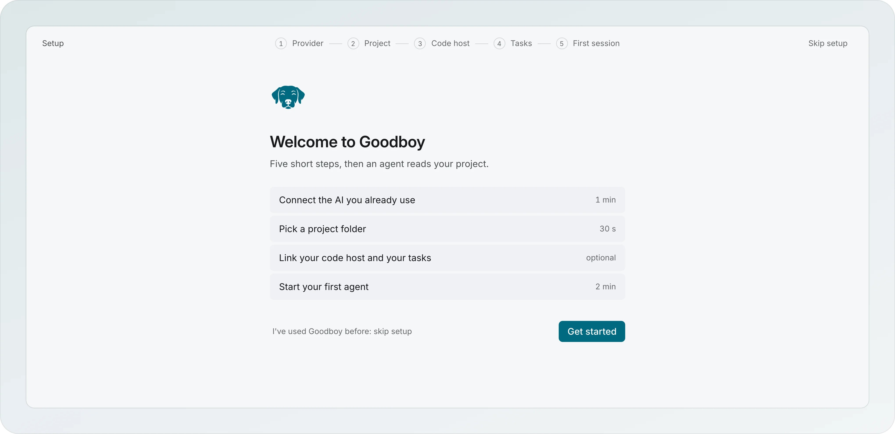
</picture>

Follow five short steps from install to a first agent reading your project: **Provider**, **Project**, **Code host**, **Tasks** and **First session**. Code host and tasks are optional, steps that do not apply to you are skipped, and **I've used Goodboy before: skip setup** takes you straight in. The last step hands you a session draft already filled in.

### Provider connection

<picture>
  <source media="(prefers-color-scheme: dark)" srcset="./docs/readme/setup-provider-connection-dark.webp">
  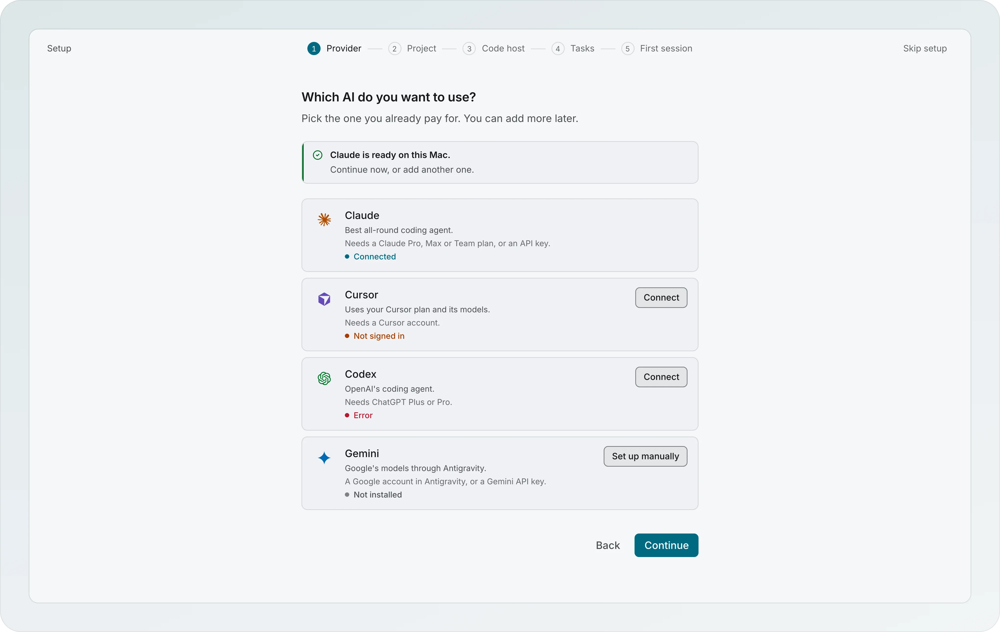
</picture>

Pick the provider you already pay for and connect it with a login or an API key. Each card says what the provider needs and where it stands: **Connected**, **Not signed in**, **Not installed**. **Connect** walks you through the sign-in, and **Open the sign-in page again** helps when no browser tab opened. You can add more providers later.

### One page per provider

<picture>
  <source media="(prefers-color-scheme: dark)" srcset="./docs/readme/setup-provider-page-dark.webp">
  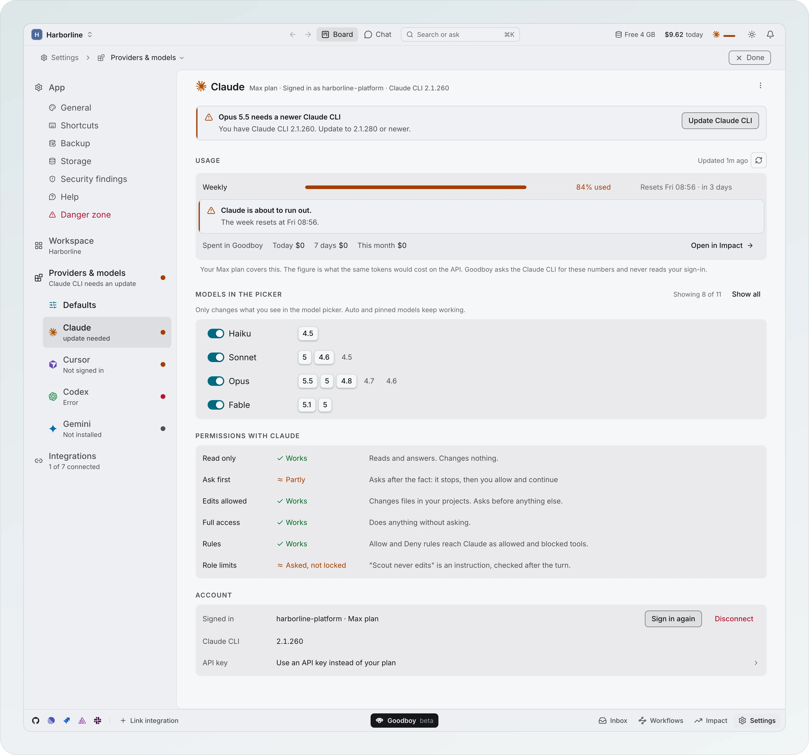
</picture>

Find everything about a provider on its own page in **Providers & models**: **Usage** with the weekly window, **Models in the picker** with a switch per model, **Permissions**, and **Account** with **Sign in again** and **Disconnect**. Providers billed per token say so instead of showing usage windows.

### Update the provider CLI

<picture>
  <source media="(prefers-color-scheme: dark)" srcset="./docs/readme/setup-cli-update-dark.webp">
  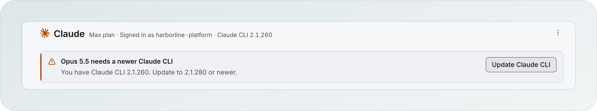
</picture>

See when a model needs a newer CLI, right at the top of the provider page, and press **Update Claude CLI** to install it. The update waits for running turns to finish. A turn the CLI refuses retries on the closest model in the same family.

### Permissions for each provider

<picture>
  <source media="(prefers-color-scheme: dark)" srcset="./docs/readme/setup-permissions-dark.webp">
  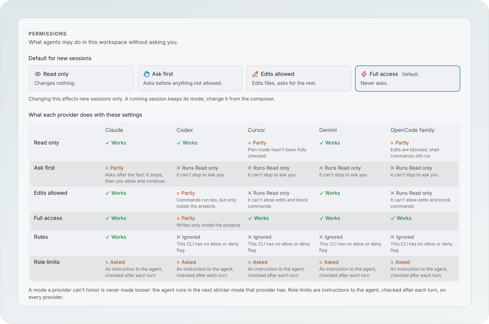
</picture>

Check which permission modes a provider can honor before you pick one: **Read only**, **Ask first**, **Edits allowed** and **Full access**. The table marks each cell as **Works**, **Partly** or **Runs Read only**, with the reason underneath, and adds a **Rules** row and a **Role limits** row. A mode a provider cannot honor never runs looser: **Ask first** on Codex runs as **Read only**. The default mode for new sessions sits above the table.

### Integrations

<picture>
  <source media="(prefers-color-scheme: dark)" srcset="./docs/readme/setup-integrations-dark.webp">
  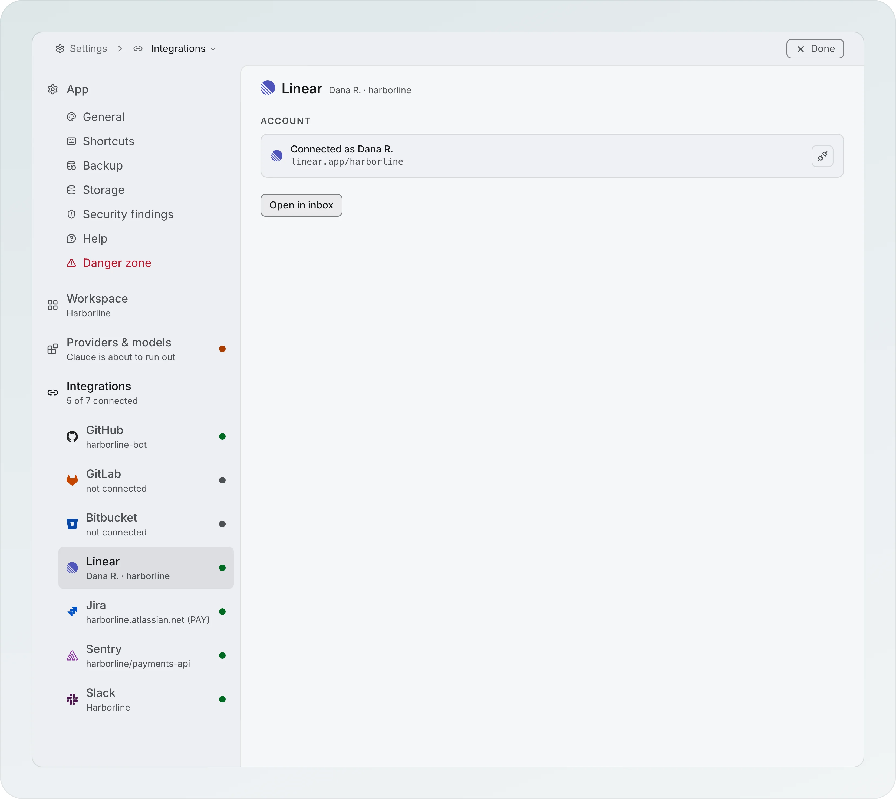
</picture>

Connect GitHub, GitLab, Bitbucket, Linear, Jira, Sentry and Slack from one page. The list shows the account behind each tool and how many are connected, and each tool opens to its own page. Give a project a different account than its workspace when you need to. Keys stay in your system credential store.

### About you

<picture>
  <source media="(prefers-color-scheme: dark)" srcset="./docs/readme/setup-about-you-dark.webp">
  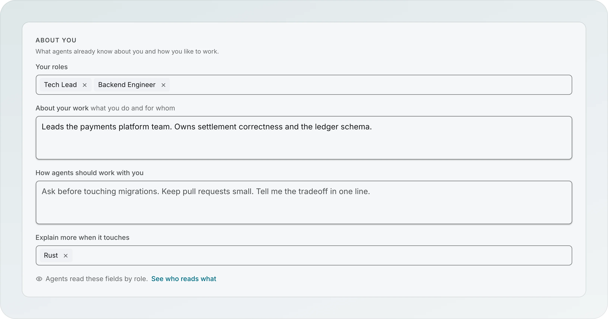
</picture>

Tell agents once who you are and how you like to work, in four short parts: **Your roles**, **About your work**, **How agents should work with you** and **Explain more when it touches**. **See who reads what** shows which role reads each part.

## Start a task

Begin from an issue, a workflow or a question, in one draft that turns into a session when you press Start.

### How do you want to start?

The **New session** draft has three tabs: **Pick up a task**, **Run a workflow** and **Ask an agent**. **Discard draft** throws it away. The draft becomes a session only when you press Start, so empty sessions do not pile up.

### Pick up a task, with a drafted brief

<picture>
  <source media="(prefers-color-scheme: dark)" srcset="./docs/readme/start-pick-task-dark.webp">
  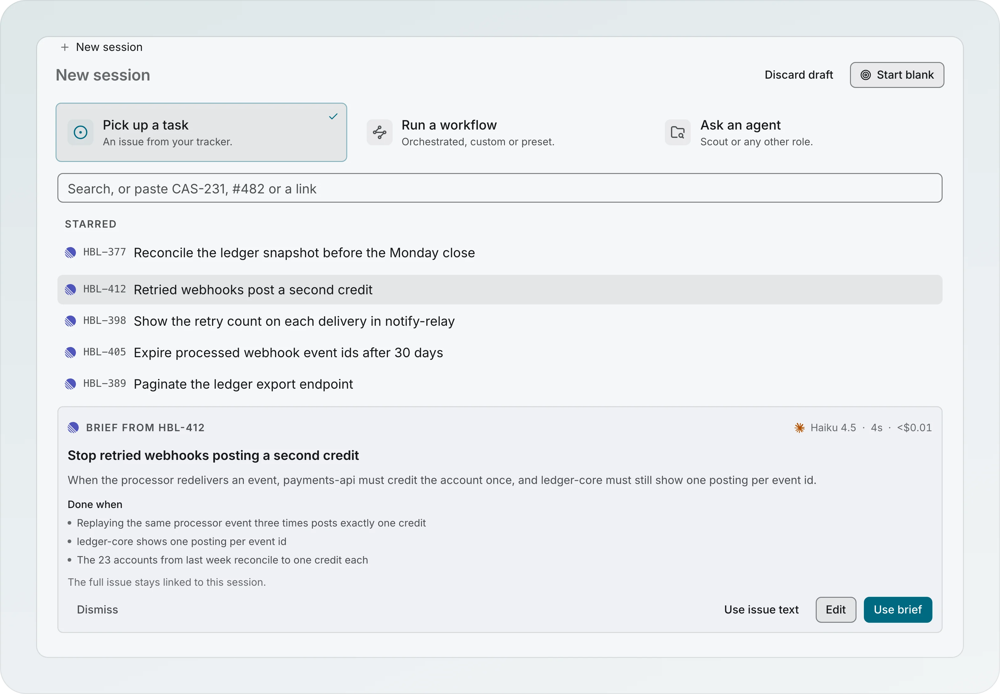
</picture>

Turn an issue into a briefed session in one pick. Pick HBL-412 and Goodboy drafts a short title, a goal and the **Done when** criteria under **Brief from HBL-412**, and the full issue stays linked to the session. Press **Use brief** to keep it, **Edit** to change it, or **Use issue text** to skip the draft. A Sentry error or a GitHub issue opens in the project it belongs to, and one Start links the issue, creates the session and starts the work.

### Run a workflow

<picture>
  <source media="(prefers-color-scheme: dark)" srcset="./docs/readme/start-run-workflow-dark.webp">
  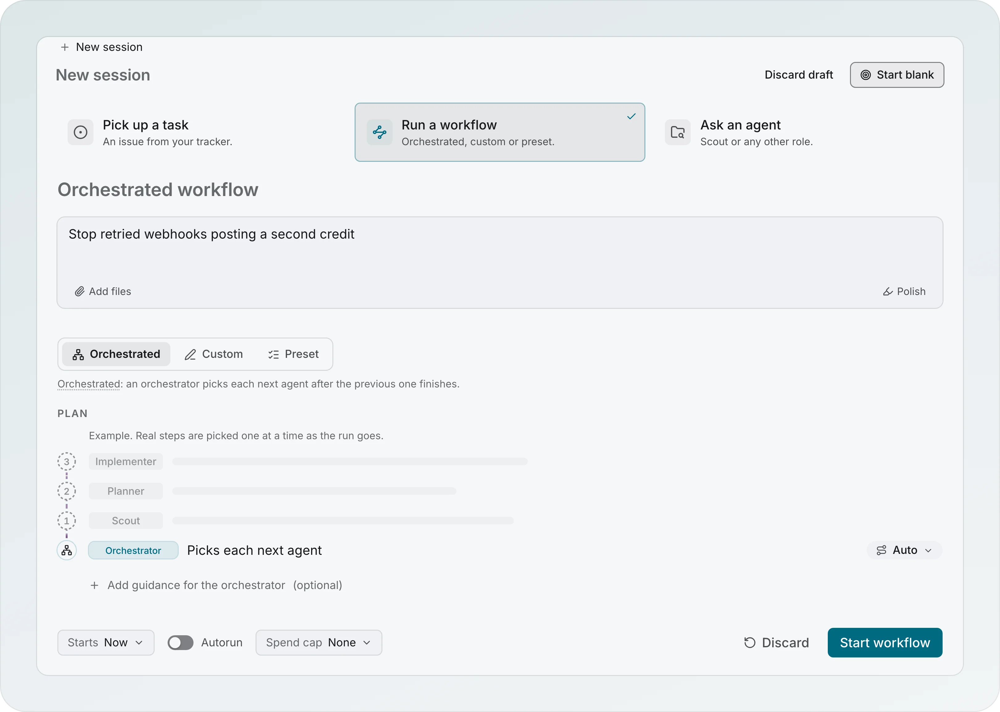
</picture>

The full workflow builder, right in the kickoff. Write the goal, pick **Orchestrated**, **Custom** or **Preset**, and read the **Plan** you will run. Under the plan, set **Starts**, **Autorun** and a **Spend cap**. **Start workflow** creates the session and starts the run in one step.

### Ask an agent

<picture>
  <source media="(prefers-color-scheme: dark)" srcset="./docs/readme/start-ask-agent-dark.webp">
  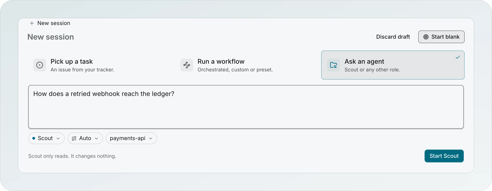
</picture>

Map an unfamiliar repo before you plan. **Scout** is the default and only reads, so it changes nothing. Type an area, a file or a question, choose the model and the project, and press **Start Scout**. With an empty field it runs on the whole project. On a broad question the scout can split the search by area, and one report merges what the child scouts found.

### Start blank

Start from the goal instead. **Start blank** sits in the header of every tab and opens the session straight on its Overview, where you add the goal, projects and work.

### Named by Goodboy

Get a short title without writing one. A new session is named for you and marked **Named by Goodboy** until you rename it.

## Overview and activity

<picture>
  <source media="(prefers-color-scheme: dark)" srcset="./docs/readme/s03-activity-dark.webp">
  
</picture>

### Session overview

Find the goal, linked issues, projects, cost and the buttons to start an agent or a workflow on one screen. **Run workflow** turns into **Open run** while a run is live, so a second one does not start on top.

### Refresh a session

See pull requests made outside Goodboy without reloading. One an agent opened or you made in a terminal shows up when the turn ends or when you come back to the window. **Refresh**, next to Archive and Delete in the session header, re-reads projects, branches and pull requests right away, also from **⌘⇧R** and the command palette.

### Activity

Read the whole session as one timeline of agents, workflows, questions, fixes, artifacts, pull requests and decisions. Each step shows provider, model, time and cost in the same columns.

### Next

Know the one move that unblocks a task, like answering a question, fixing a failing check or opening a pull request. **Not now** puts it away until the situation changes.

### Time left

See how long a step has left, learned from your own past runs. Queued steps show a range, a slow run says "Longer than usual", and thin history shows a count instead of a guess.

### File versions

Undo an agent's edit in a session without a branch: each file it changed is kept as it was, with **Restore**.

## Switch between tasks

<picture>
  <source media="(prefers-color-scheme: dark)" srcset="./docs/readme/s30-notifications-dark.webp">
  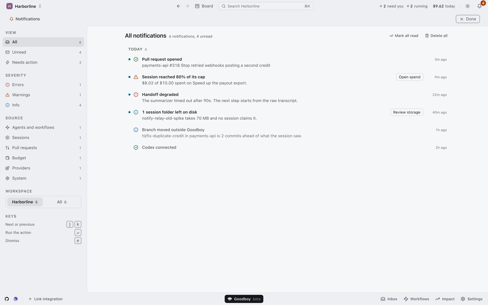
</picture>

### Activity bar

Move between tasks without losing your place. The bar on the left of every session lists all the sessions of the workspace, grouped by where they stand: **building**, **running**, **needs you** and **in review**, with done work folded away. Each row says what it is waiting on, like **1 to answer** or **draft PR #90**, so you open the one that needs you, and its Overview shows what ran, what was decided and what comes next. Group it by stage or by pull request, or filter it to one project.

### Now chip

Know what needs you from any screen. A top-bar chip counts sessions that need you, running sessions and running scripts.

### Notifications

Catch up in one place. Everything Goodboy has to tell you, from a pull request opened to a session close to its spending cap, lands in one list: a bell with an unread count, and a page grouped by severity, source and workspace. **Unread** and **Needs action** cut it down, and a row that needs you carries its next step, like **Open spend** or **Review storage**.

### Open in new window

Give each workspace its own window, so switching does not interrupt running agents. A workspace that is already open brings its window forward instead of opening twice. After a reload or an update, and on every launch with **Reopen last** on, every window comes back on the screen, tab and panel it showed.

## Search and navigation

<picture>
  <source media="(prefers-color-scheme: dark)" srcset="./docs/readme/s28-search-dark.webp">
  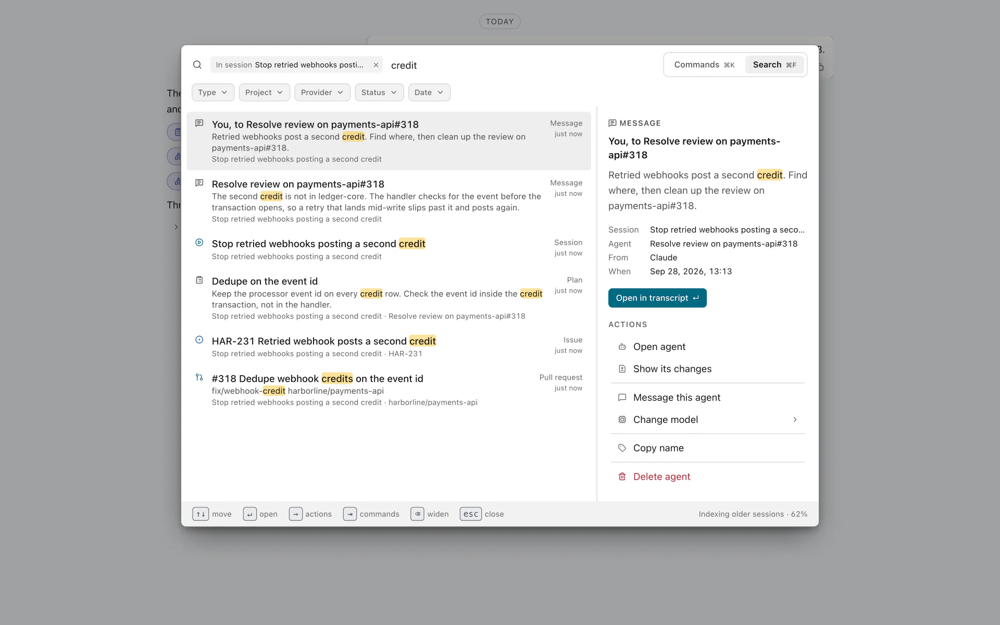
</picture>

### Go anywhere

Reach any screen without the mouse. **⌘K** opens on what you are looking at, and typing a few letters finds any session of any workspace, an agent, a plan or a page. **⌘F** switches the same window to search.

### Command palette

<picture>
  <source media="(prefers-color-scheme: dark)" srcset="./docs/readme/s29-palette-dark.webp">
  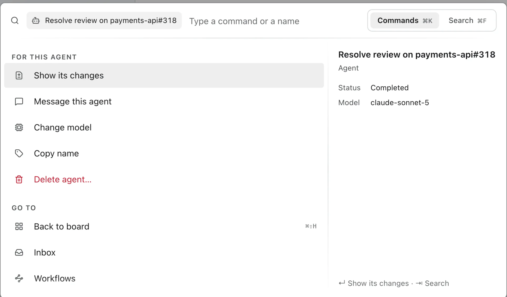
</picture>

Press **⌘K** to act on what you are looking at: the verbs of the open session or agent come first, and **→** shows every action of any row. Type a few letters of any word to find sessions of every workspace, agents, plans, pages, scripts and actions, ranked by how well they match and how often you use them. The composer's prefixes work here too. Any search with text starts with **Ask in Chat**, which opens a new chat with what you typed as its first message.

### Search

Find a message, a plan, a decision, an issue or a branch with **⌘F**, across every session, filtered by type, project, provider, status or date. Pick a hit to land on it in context, then walk the other matches in that view with **⌘G**. The index stays on your computer.

### Right click menus

Right click a session, agent, run, artifact, pull request, worktree row, diff file or message to see every action it has, at the pointer. The **⋯** menu and the palette list the same actions in the same order, and one that cannot run says why. **Shift+F10** opens the menu on the focused row.

## Workspace and projects

<picture>
  <source media="(prefers-color-scheme: dark)" srcset="./docs/readme/s27-workspace-dark.webp">
  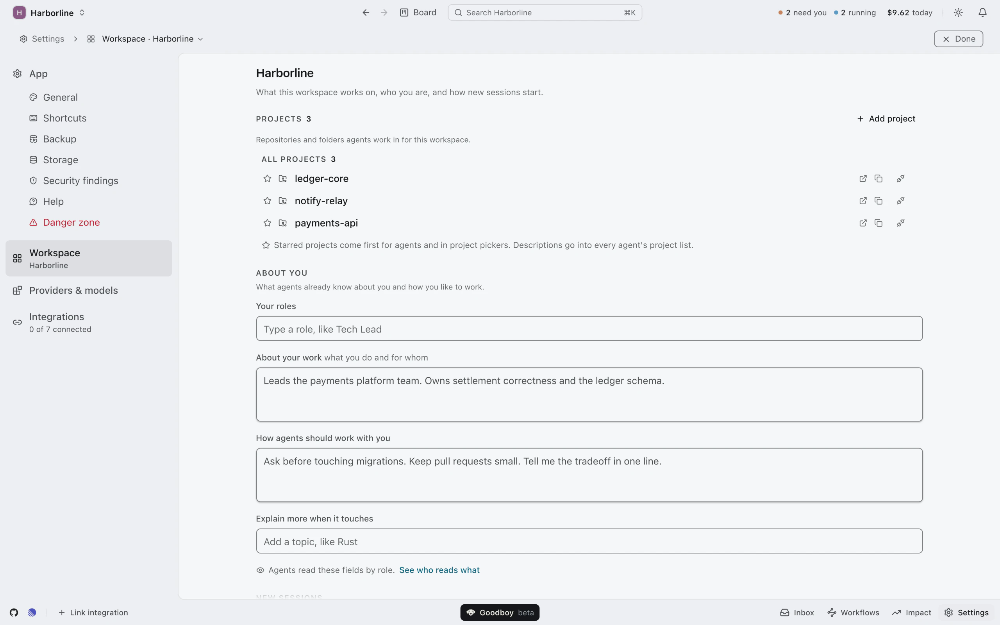
</picture>

### Workspace with several projects

Keep your repos together as one workspace, and let one session work across several of them. A project gets a branch only when an agent needs to edit it, and the timeline records why.

### Starred projects, descriptions and base branch

Point agents at the right repo without naming it. Starred projects and their one-line descriptions go into each agent's brief, and each project shows its base branch, read from origin.

### Worktrees

<picture>
  <source media="(prefers-color-scheme: dark)" srcset="./docs/readme/s10-projects-dark.webp">
  
</picture>

Let agents edit in parallel without touching your checkout. When an agent needs to edit a repo, that work gets its own worktree and branch. **Copy worktree path** in **⌘K** copies where a session works, or lets you pick one when it has several, with **⌘Enter** to copy them all.

### Several branches per project

Work on several branches of one repo in the same session. If a worktree drifts to another branch, Goodboy offers **Use this branch here** or **Keep both branches**.

### Workspace switcher and Reconnect

Jump between workspaces and projects from one search. Disconnecting a workspace keeps its history, and adding its folder again offers **Reconnect**.

### Repo status across projects

See which repos are behind, uncommitted or diverged from the board's **N repos** popover, and update the safe ones together. Updates are fast-forward only and leave dirty or diverged repos to you.

### Locate moved projects

Moved your repos to a new folder? Pick the parent folder and Goodboy finds them, fixes the stored paths and repairs the worktrees, with **Undo move**. Repos are matched by their first commit and remote, not by folder name.

### Keep .goodboy out of git

Keep Goodboy's own folder out of your commits with one click. The card shows up only when git does not already ignore `.goodboy`, your global rules included.

## Branch history

Reshape a branch before it goes to review: fold, move, rename and remove commits, see what would conflict, and apply with a backup one click away.

### Rewrite history

<picture>
  <source media="(prefers-color-scheme: dark)" srcset="./docs/readme/history-rewrite-dark.webp">
  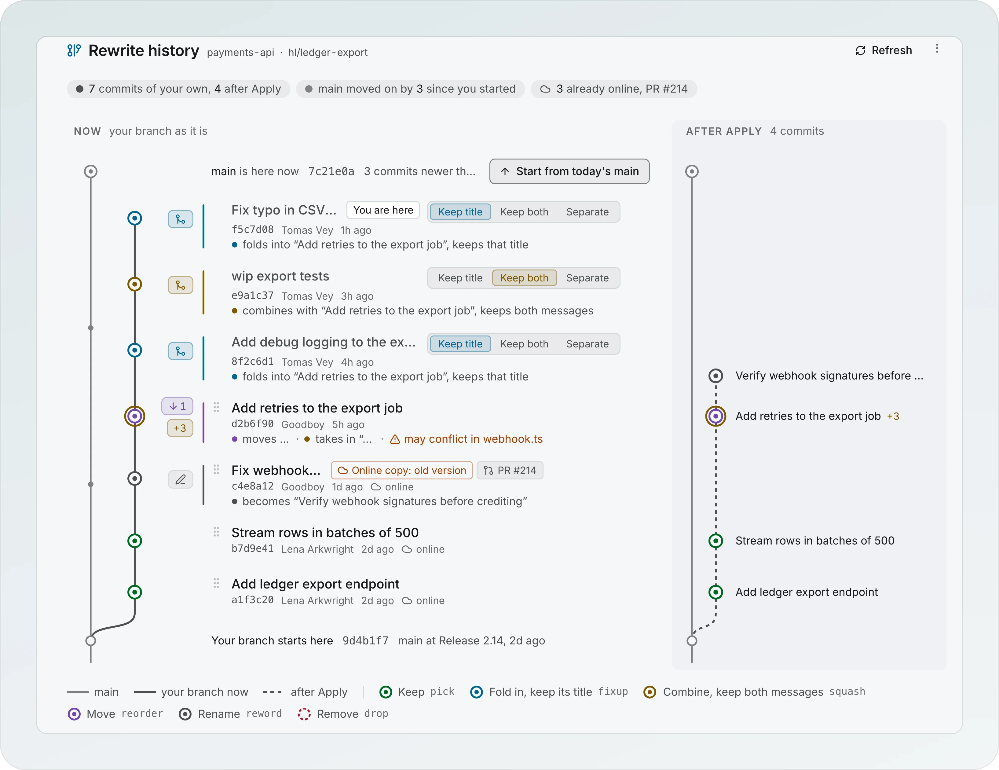
</picture>

Clean up a branch by hand. Drag a commit between two others to move it, drop it onto another to fold it in, or rename or remove it. **Start from today's main** moves the branch start onto the latest main. A folded commit chooses **Keep title**, **Keep both** or **Separate** in one control, and hovering any commit of a fold highlights the whole group. The branch is drawn as it is **Now**, next to what it becomes **After Apply**, with a color for each kind of change. Each row's buttons, its `⋯` menu, a right click and **⌘K** on the focused row offer the same actions.

### Safe apply

<picture>
  <source media="(prefers-color-scheme: dark)" srcset="./docs/readme/history-trial-dark.webp">
  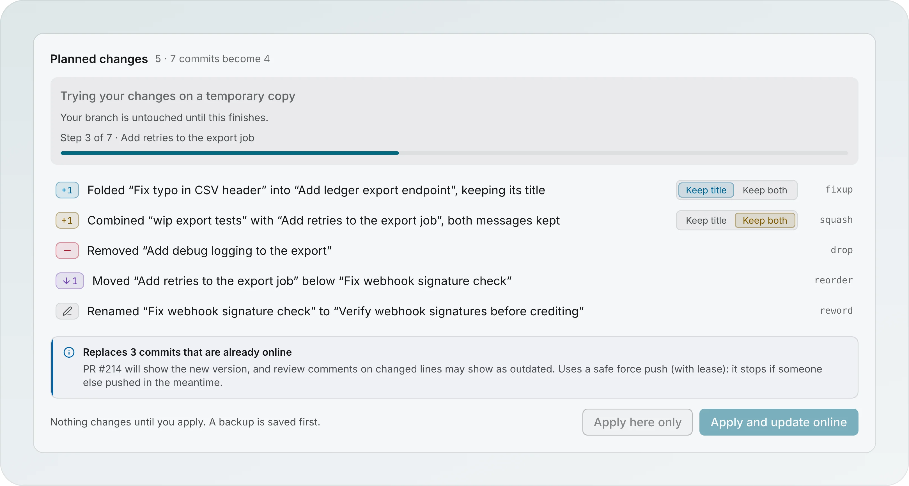
</picture>

**Apply here only** and **Apply and update online** try the whole plan on a temporary copy first and check the result before your branch moves. A progress line names the step it is on, and a backup is saved before anything changes. If a step stops, it says which one and why, and your branch stays exactly as it was.

### Conflict prediction

<picture>
  <source media="(prefers-color-scheme: dark)" srcset="./docs/readme/history-conflicts-dark.webp">
  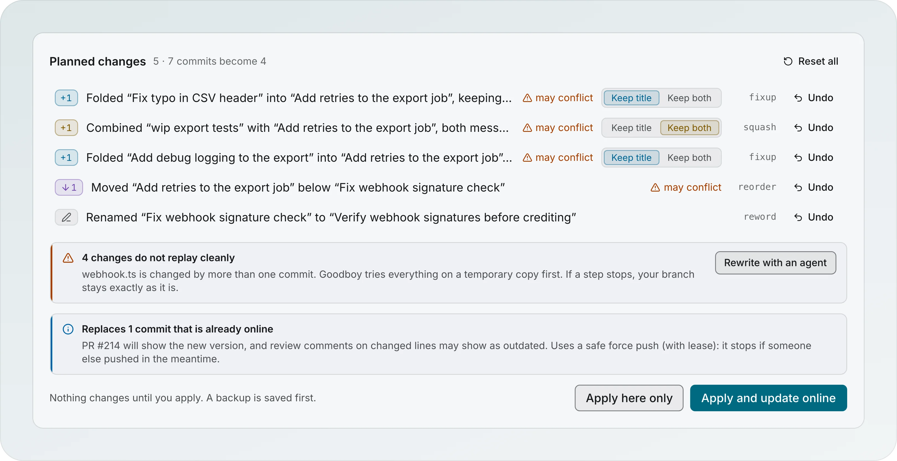
</picture>

While you edit the plan, Goodboy tries it in memory and marks each change that may conflict. A warning names the file, here `webhook.ts`, and how many changes would not replay cleanly. Your checkout stays as it is.

### Conflicts merged in a copy

<picture>
  <source media="(prefers-color-scheme: dark)" srcset="./docs/readme/history-stopped-dark.webp">
  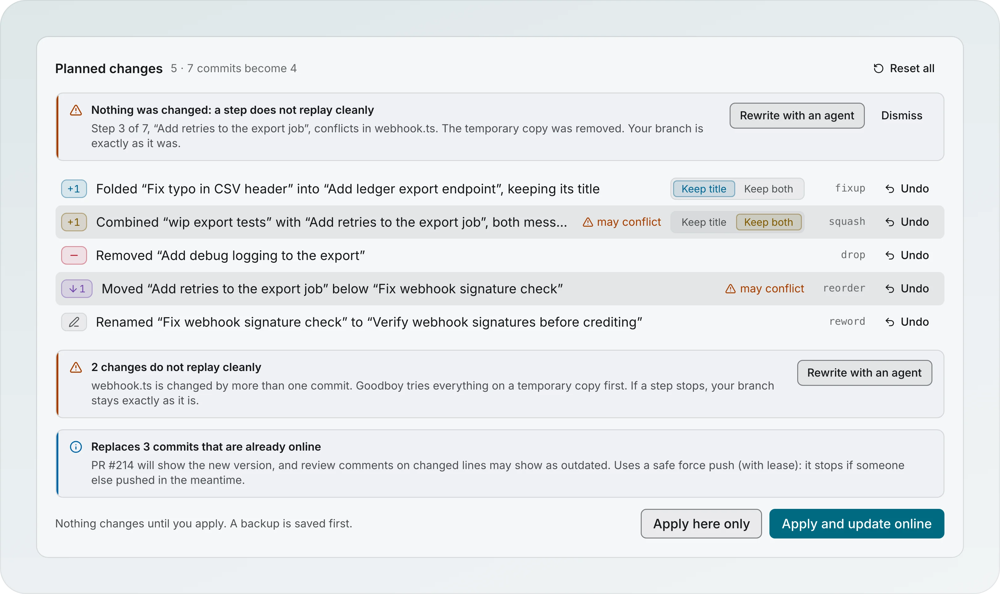
</picture>

When a step stops on a conflict, the notice says which step and file, and your branch is untouched. Click **Rewrite with an agent** to let the History rewriter merge the conflict in a copy. Goodboy checks the result before anything moves.

### Push with lease and restore

<picture>
  <source media="(prefers-color-scheme: dark)" srcset="./docs/readme/history-result-dark.webp">
  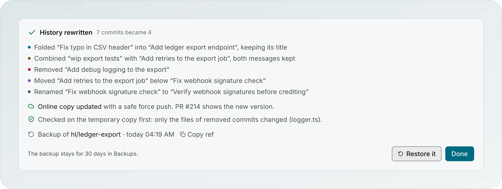
</picture>

**Apply and update online** replaces the online branch only when nothing newer is there, so a teammate's push is never overwritten. The result lists what changed and confirms the online copy. **Restore it** takes the old history back, and the backup stays for 30 days.

### Backups

<picture>
  <source media="(prefers-color-scheme: dark)" srcset="./docs/readme/history-backups-dark.webp">
  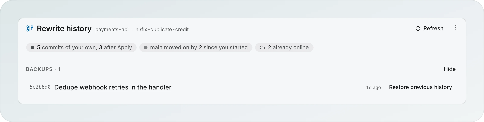
</picture>

Open the `⋯` menu and choose **Backups** to see the older histories of this branch. **Restore previous history** puts one back, and **Hide** closes the list.

### Suggest a message

Get a commit message drafted for a squash or a reword. Scribe writes it in place, and you can edit it before you apply.

### Bring them into the plan

Someone pushed after you applied? Goodboy lists their new commits and offers to add them to the plan and push again.

### Rebase on main

Rebase on main with the same engine, and bring in an agent only when there is a conflict.

### After a pull request merges

Decide what happens to a merged branch, **Ask me**, **Delete on this Mac** or **Also on origin**, per workspace or project, with 14 days to restore it. A branch with later commits, uncommitted changes, or one Goodboy did not create is left alone.

## Review, resolve and pull requests

<picture>
  <source media="(prefers-color-scheme: dark)" srcset="./docs/readme/s12-resolve-dark.webp">
  
</picture>

### Resolve

Turn review comments into commits without writing the fix yourself. Review lists the comments on the left and the one you picked on the right. Press **Draft fixes for N** and an agent writes each fix as a local commit and drafts the reply, then you accept it, edit it, reply yourself or skip the comment.

### Comment states

Know what each comment needs next. Each one shows a state like **Not started**, **Drafting**, **Needs you**, **Ready** or **Outdated**, grouped as **Open**, **Waiting for the push** and **Done**.

### Close on GitHub

Finish a review in one action: **Push N** in the Review header pushes the fixes, posts the replies and resolves the threads, after a confirm right under the header. After an interruption Goodboy looks for your reply in the thread before posting it again.

### Review replies in your voice

Get replies that sound like you, **Terse**, **Friendly**, **Formal** or **Like my replies**. **Like my replies** reads your last 20 review replies and writes a style note you can edit.

### Fixes on a branch that moved

Accept a fix even after the branch got new commits: it lands on top of the latest one, and on a conflict the branch goes back to its old head.

### Notes before a pull request

Review your own diff before anyone else does. Leave notes, resolve them like review comments, and post the open ones to the pull request later.

### GitHub pull request page

Know whether a GitHub pull request can merge, in plain words, with details and checks, and merge, mark ready, draft or close it from there. The next step is the one main action, such as **Mark ready for review** on a draft or **Squash and merge** once it is approved and green. **Merge** and **Close** confirm right under the header, and **N comments to resolve** opens Review.

### Pull request, Diff and Review as layers

<picture>
  <source media="(prefers-color-scheme: dark)" srcset="./docs/readme/s31-pull-request-dark.webp">
  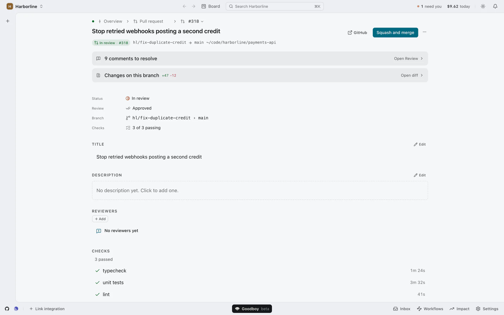
</picture>

Move between a pull request, its Diff and its Review without losing your place. They open as one path in the trail from the worktree row, and Back walks it. Every link to a pull request lands on its page.

### Write it for me

Get a pull request title, description and changelog entry in your repo's format when you open a pull request. Linked issues become closing references.

### PR description follows the push

Keep a pull request description in step with its branch. After a history push, a description Goodboy wrote is updated to match, unless you edited it.

### Diff

<picture>
  <source media="(prefers-color-scheme: dark)" srcset="./docs/readme/s17-diff-dark.webp">
  
</picture>

Read changes with syntax colors, word-level highlights, split or unified view and a **Viewed** tick per file, and quote a line into a note or a question for an agent. The header offers the next step for the branch, such as **Rebase on main**, **Push N commits** or **Create PR**.

### Write review

Review someone else's pull request in a form under the diff: your line comments, the verdict and a summary, sent with **Approve**, **Request changes** or **Submit comments**. Outdated drafts are marked **Stale**.

## The board

<picture>
  <source media="(prefers-color-scheme: dark)" srcset="./docs/readme/s01-board-dark.webp">
  
</picture>

### Stage board

See where each task stands without moving cards around. Each session sits in **building**, **running**, **needs you**, **in review** or **done**, based on what is happening in it.

### Session card

Read a task at a glance: pull request, issue and project chips, step progress, agent count, age and cost, plus one suggested action.

### Done and Archived dock

Keep finished work out of the way but close by. Done and archived sessions fold into two icons at the side of the board, and hovering previews them.

### Bulk select

Tidy many sessions at once. Lasso or modifier-click cards across columns, then archive, restore or delete them together.

## Workflows

<picture>
  <source media="(prefers-color-scheme: dark)" srcset="./docs/readme/s05-workflow-builder-dark.webp">
  
</picture>

### Workflow builder

Shape a run before it starts: a name, a goal and a mode, with the plan previewed as the tree the run will show.

### Orchestrated

Give a goal and let a model pick each next step, with its role, provider, model, effort and a reason, until it says done or blocked.

### Hints to the orchestrator

<picture>
  <source media="(prefers-color-scheme: dark)" srcset="./docs/readme/s04-workflow-run-dark.webp">
  
</picture>

Steer a run while it goes. **Queue** waits for the next decision, and **Read now** stops the step in flight, keeps what it wrote and decides again.

### Why each step, and the run recap

See why each step was picked, and a short recap of what is done and what is left, rewritten after each decision.

### Preset and Custom

Write the steps yourself, press **Draft with planner**, or start from a saved workflow. **Save as preset** keeps what you changed.

### Built-in workflows

Start from **Refactor**, **Plan and ship** or **Fix a bug**. A built-in you delete stays deleted until you press **Restore built-in workflows**.

### Saved steps

Reuse steps across workflows. The 8 built-in steps are read-only, and **Save a copy** makes your own.

### Model per step

Put a light model on a scout and a strong one on the planner. Each step has its own provider, model and effort, and Goodboy records what actually ran.

### Autorun

Let a run move to its next step without you, per run or for the whole session. A guard stops an agent after 4 unattended turns in an hour, and anything you write to it resets the count.

### Spend limit

Cap what a run or a session can spend, and choose **Pause workflows** or **Only warn me**. A paused run offers **Raise limit**.

### Chained starts

Line work up behind work: start a run now, by hand, or after another run finishes.

### Workflow run

Follow a run as a tree with one pinned next action, and add steps to a live or finished run. Deleting a run deletes its agents and their open questions with it.

### Step handoff summary

Start each step from a short brief instead of the whole previous chat. If the summary fails, Goodboy keeps the start and end of the chat and marks the brief as degraded.

### Open questions

<picture>
  <source media="(prefers-color-scheme: dark)" srcset="./docs/readme/s07-questions-dark.webp">
  
</picture>

Get each question as one card: who asks, whether it blocks, the question, and its answers as numbered tiles with the recommended one tagged. Pick with a number key, answer with Enter, or write something else in line. The Questions lens lists what waits on you next to the question you are answering, and j and k move through the list. The same card sits at the end of the transcript and at the top of the agent's Brief. The answers to one agent go out together once you answered its last question, and until then each one keeps an Undo. An agent can mark a question as blocking, which holds its step until you answer. Each question shows once in the session activity, on the row of the agent that asked, and **Answer** on a workflow row opens that agent right at its question.

### Let an agent decide

Hand a question to another agent with a hint and a model from **Let an agent decide**, and its answer counts as yours. **Answer it yourself** takes it back.

### Import workflows

Bring custom workflows over from your other workspaces.

## Inbox and your tools

Connect your trackers, code hosts and Slack once. Their work lands in one Inbox, and agents can read and act on it.

### Supported tools

Connect the ones you use in **Settings**, **Integrations**. Each one feeds the Inbox and can start a session with its brief drafted.

- **GitHub**: issues and pull requests, review comments you resolve with an agent, and the pull request page
- **GitLab**: issues and merge requests, with threaded discussions, replies, approvals and merge
- **Bitbucket**: pull requests, with comments, approvals and merge
- **Jira**: issues you comment on, assign, edit and move between statuses
- **Linear**: issues you comment on, assign, edit and move between states, with threaded replies
- **Sentry**: errors with stack trace, breadcrumbs and tags, ready to hand to an agent
- **Slack**: threads from the channels you pick, where agents read, reply and react, and replies wait for your OK by default

### Agents use your tools

Let agents on any provider read and act on GitHub, GitLab, Bitbucket, Jira, Linear, Sentry and Slack, as far as you connected them, without handing them your keys. The agent asks Goodboy over a local socket only your user can open, and Goodboy makes the call.

### Inbox

<picture>
  <source media="(prefers-color-scheme: dark)" srcset="./docs/readme/inbox-list-dark.webp">
  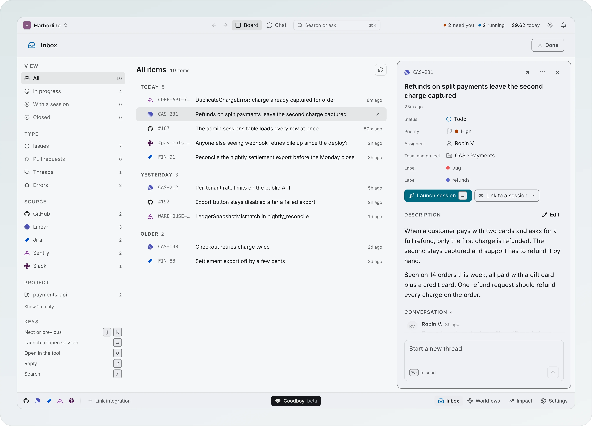
</picture>

Work from one list instead of seven tabs. Issues, Slack threads and Sentry errors from your connected tools sit together, grouped by day, next to pull requests from GitHub (review requests and your own recent ones) and merge requests from GitLab and Bitbucket. Narrow the list by **View**, **Type**, **Source** and **Project**, and move with **j** and **k**. Sentry errors filter by the project they belong to, and GitHub or GitLab items too when several projects live on that host. Linear and Jira stay one flat list.

### Find any issue by code or link

<picture>
  <source media="(prefers-color-scheme: dark)" srcset="./docs/readme/inbox-lookup-dark.webp">
  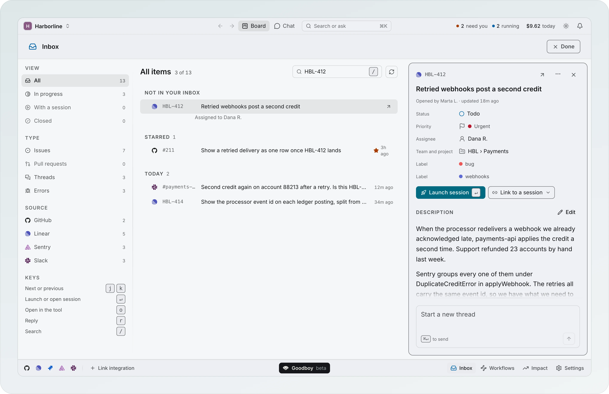
</picture>

Paste `HBL-412`, `#318` or a link in the search box and open the issue, even when it is not assigned to you. It appears under **Not in your inbox** with its full details beside it. An unknown prefix is tried on Linear and Jira at once.

### Starred issues

Star an issue to keep it on top of the Inbox and of **Pick up a task**. In the search result above, the **Starred** group holds the GitHub issue #211.

### Launch a session from any item

Press **Launch session** on an issue, a Slack thread or an error to start a session with the brief already drafted. A Sentry error or a GitHub or GitLab item opens in its project, and the popover says why.

### Link an item to a session

Attach an inbox item to work that already exists. **Link to a session** sits next to **Launch session** and links the task to the session you pick. From a session it works the other way round: **Link work** in the Overview header, or **L**, opens one search across every connected tracker, with your recent inbox items on top. Filter by source, type an issue code, or paste a link.

### Trackers

<picture>
  <source media="(prefers-color-scheme: dark)" srcset="./docs/readme/inbox-sentry-dark.webp">
  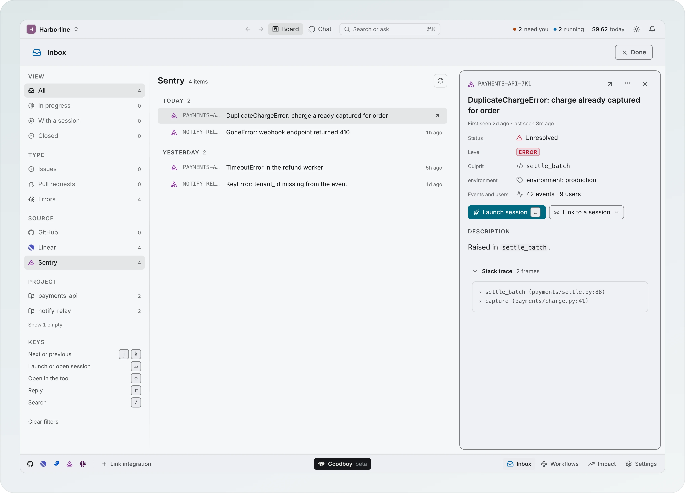
</picture>

Read Sentry errors with stack trace, breadcrumbs and tags inside Goodboy, and filter them by project. Comment, assign, edit and move issues in Linear and Jira the same way.

### Code hosts

Work on GitHub pull requests and issues, GitLab merge requests, and Bitbucket comments, approvals and merges without leaving Goodboy. GitHub and GitLab can work side by side, one for code and one for tickets.

### Slack: what agents can do

<picture>
  <source media="(prefers-color-scheme: dark)" srcset="./docs/readme/inbox-slack-permissions-dark.webp">
  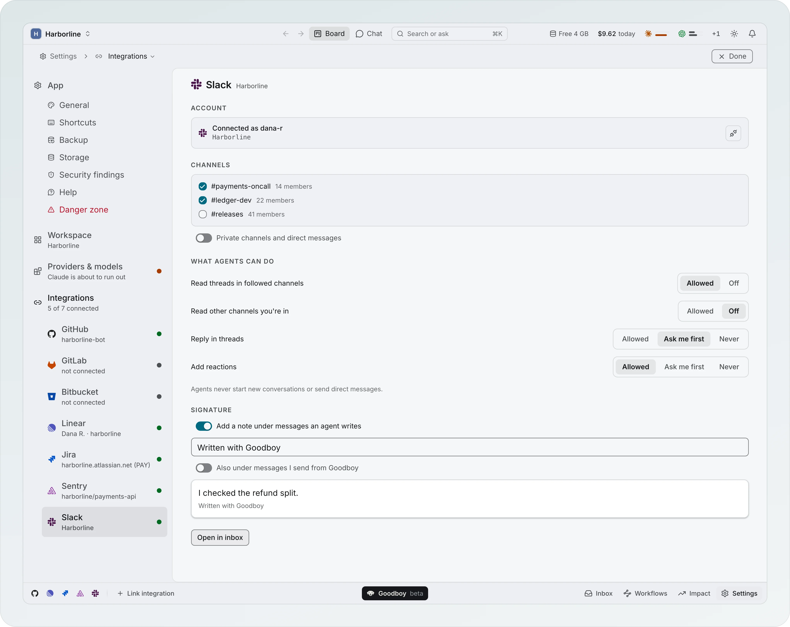
</picture>

Decide how far agents go in Slack. Tick the channels they follow, then set each action: **Read threads in followed channels** and **Read other channels you're in** are **Allowed** or **Off**, **Reply in threads** and **Add reactions** are **Allowed**, **Ask me first** or **Never**. Replies default to **Ask me first**, and agents never start new conversations or send direct messages.

### Reply ready for #channel

<picture>
  <source media="(prefers-color-scheme: dark)" srcset="./docs/readme/inbox-slack-reply-dark.webp">
  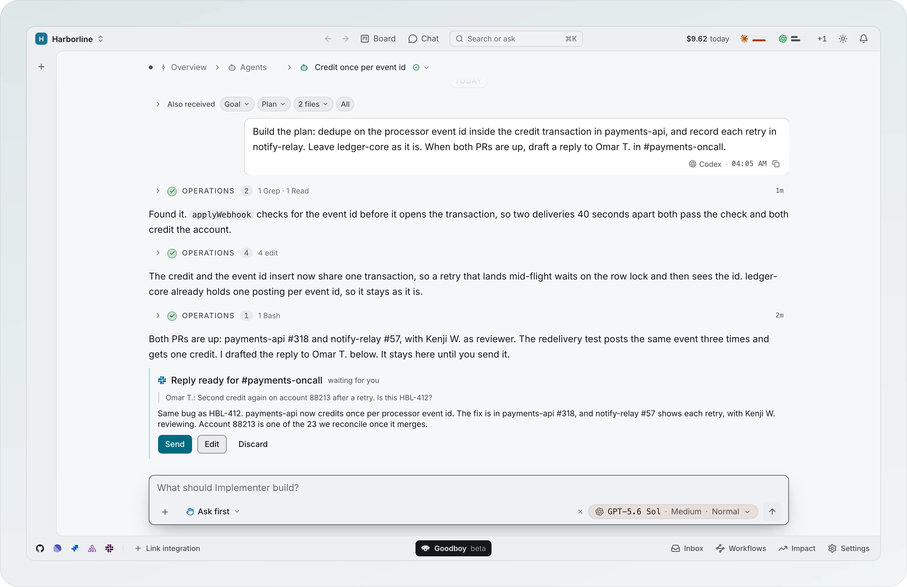
</picture>

Approve what goes out in Slack from where you already are. Under **Ask me first**, the agent's reply waits in the session as a card with the message it answers and the draft, and you choose **Send**, **Edit** or **Discard**.

### Slack signature

Let people in a thread see when an agent wrote a reply. Under **Signature** in the Slack settings above, the note under agent messages is "Written with Goodboy" by default, and you can change the text or switch it off. A second switch adds it to messages you send from Goodboy.

### Images from your tools

See screenshots attached in Linear, Jira and GitHub inside Goodboy. Your key goes only to that tool's own image host.

### Records read the same way

Read items from any tool the same way: one list of labels and values, with who opened them and when.

### Comment threads

<picture>
  <source media="(prefers-color-scheme: dark)" srcset="./docs/readme/inbox-comment-threads-dark.webp">
  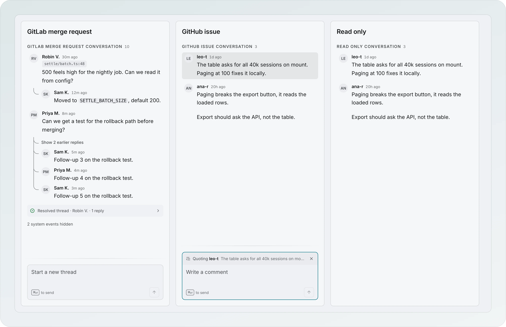
</picture>

Follow replies under the comment they answer, in Linear and GitLab, and fold long threads behind **Show earlier replies**. Press **Reply** on a comment to answer inside its thread, or start a new one in the box below. Where a tool has no threads, the box shows **Quoting** and the name of the comment you answer.

## Plans, reports and wireframes

Plans, reports and wireframes live next to the task, not inside a chat.

### Artifacts

<picture>
  <source media="(prefers-color-scheme: dark)" srcset="./docs/readme/artifact-list-dark.webp">
  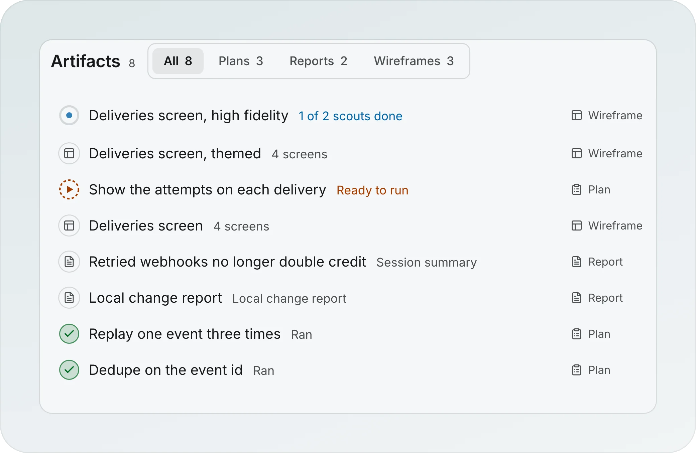
</picture>

Keep plans, reports and wireframes next to the task, each with its kind, the step that made it, its revision and its date. The tabs **All**, **Plans**, **Reports** and **Wireframes** filter the list, and **New** starts another one. A row shows its state at a glance: **1 of 2 scouts done**, **Ready to run** or **Ran**.

### Plan parts and Run plan

Check a plan before it runs. A plan can give each part done-when checks and the files it expects to touch, and **Run plan** turns each part into a sub-agent.

### Report as a document

<picture>
  <source media="(prefers-color-scheme: dark)" srcset="./docs/readme/artifact-report-dark.webp">
  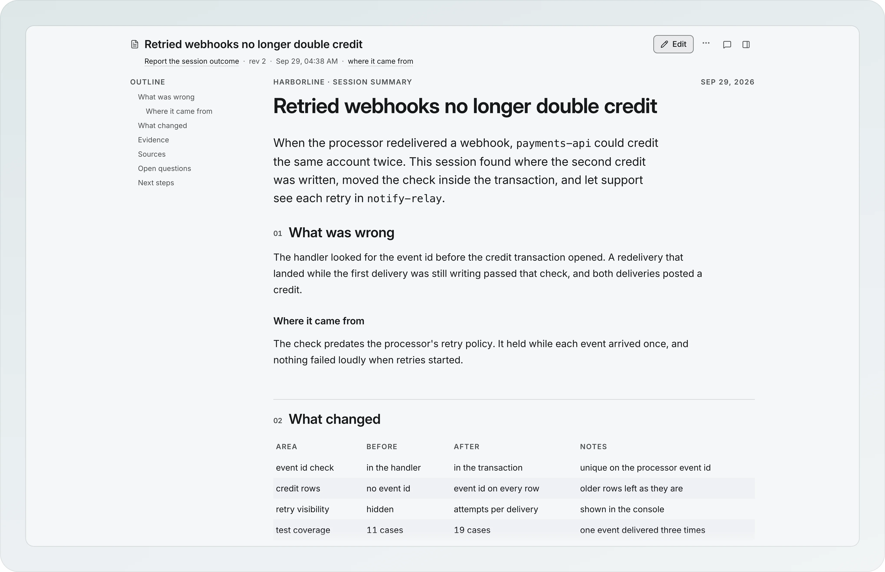
</picture>

Read a report as one document. The **Outline** on the left jumps to each section, and **Edit** changes the text in place. The same file opens in a browser on another machine.

### Files on disk

Open any artifact as a folder, in your browser or your file manager. The folder is rewritten on each revision and follows renames.

### Create a wireframe

<picture>
  <source media="(prefers-color-scheme: dark)" srcset="./docs/readme/artifact-create-dark.webp">
  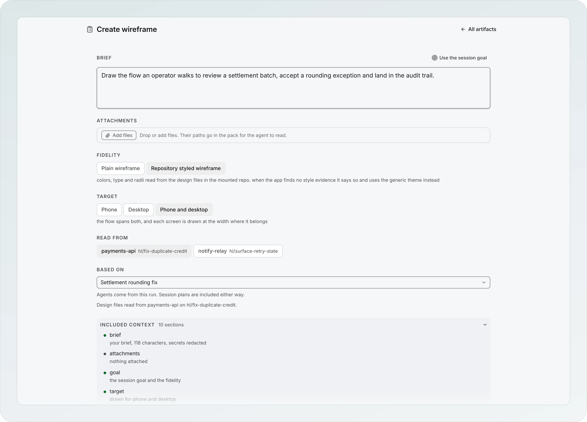
</picture>

Describe the screen in a **Brief**, add **Attachments**, and choose the **Fidelity** (**Plain wireframe** or **Repository styled wireframe**) and the **Target** (**Phone**, **Desktop** or **Phone and desktop**). **Read from** picks the project branches the agent looks at, and **Included context** lists exactly what goes in the pack.

### Wireframes scouted first

<picture>
  <source media="(prefers-color-scheme: dark)" srcset="./docs/readme/artifact-scouts-dark.webp">
  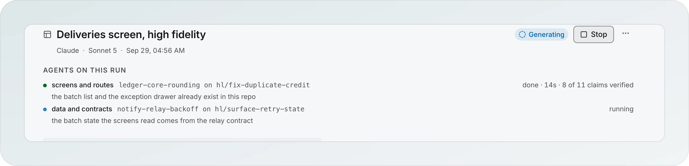
</picture>

Get wireframes that start from your code. Before drawing, two scouts read the repo, one for **screens and routes** and one for **data and contracts**. Each claim they make has to cite a file that exists, and the run shows how many were verified. **Stop** ends the run.

### Wireframe versions

Go back to any wireframe version with **View**, **Compare** and **Restore**.

### Compare

<picture>
  <source media="(prefers-color-scheme: dark)" srcset="./docs/readme/artifact-compare-dark.webp">
  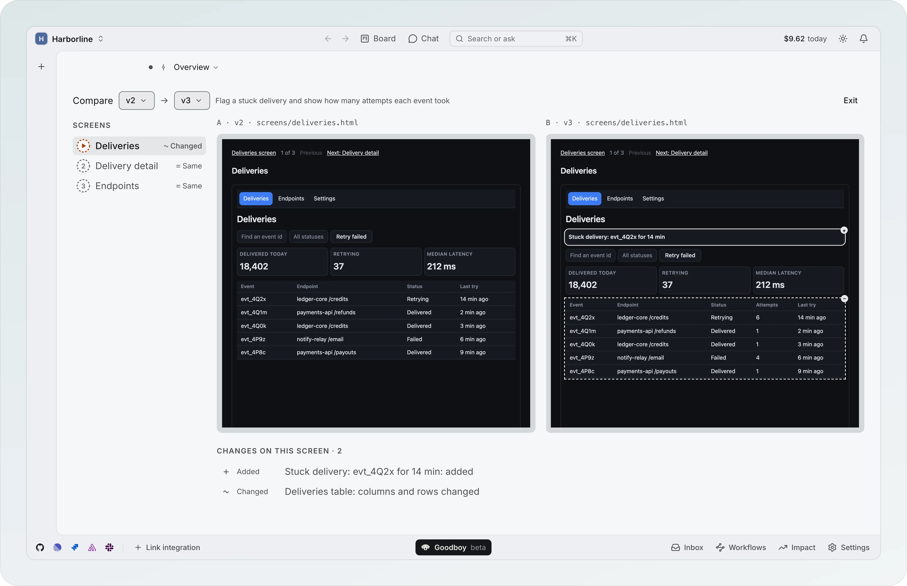
</picture>

See what changed between two wireframe versions side by side. Pick the versions at the top, pick a screen on the left, and read the change list underneath. The added banner and the changed table are outlined in the right frame.

### Ask for a change

Point at what you want changed: pick elements on the wireframe, choose this screen or all screens, and ask.

### Import wireframe JSON

Bring in a wireframe made elsewhere, with a preview of any fixes before it lands.

### Revisions and Restore

Bring back an earlier plan, report or wireframe as a new revision, with its author, without losing the later ones.

### Save a copy and New variant

Export a wireframe as a folder of pages, or redraw it at the other fidelity.

## Shared context

What one agent learns, the next one reads. The goal, decisions and a running summary travel with the session.

### Decisions

<picture>
  <source media="(prefers-color-scheme: dark)" srcset="./docs/readme/context-decisions-dark.webp">
  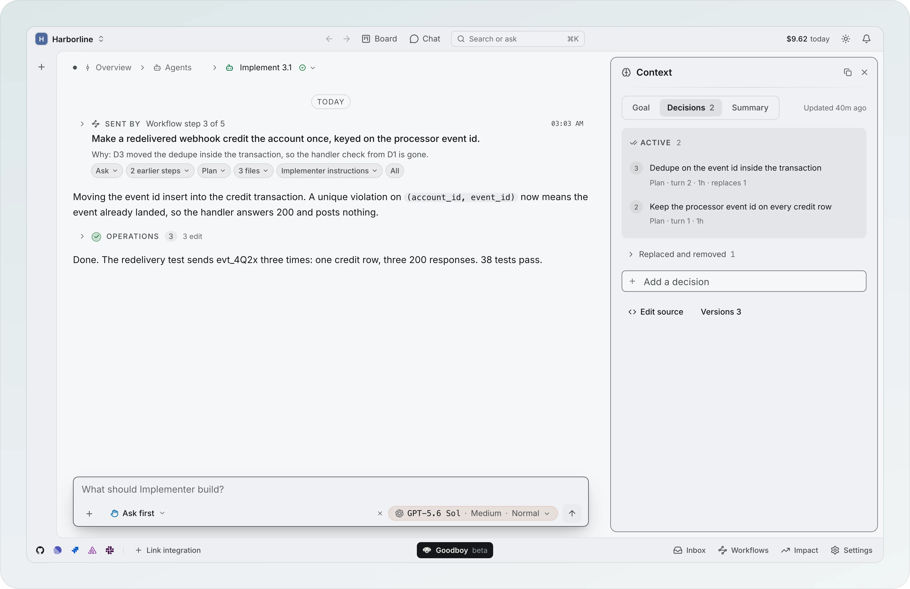
</picture>

Record a decision once and have the agents after it read it. Each one gets a number and a byline, and replacing or withdrawing it needs a reason that stays next to it. Here decision 3 replaces decision 1, so the brief the implementer received carries the new one and says why. Click a decision to open it, with **Edit** and **Remove** inside. A removed decision is retired at once and stays in the list with **Undo** while the drawer is open, and closed decisions are split into **Removed by you** and **Replaced**.

### See why each decision was made

Read the reason behind a decision without opening the run. When Goodboy records a decision from a session, it keeps the reason that came with it, and the context drawer shows it as a muted line under the decision, with **Show more** when it runs long.

### Running summary

<picture>
  <source media="(prefers-color-scheme: dark)" srcset="./docs/readme/context-summary-dark.webp">
  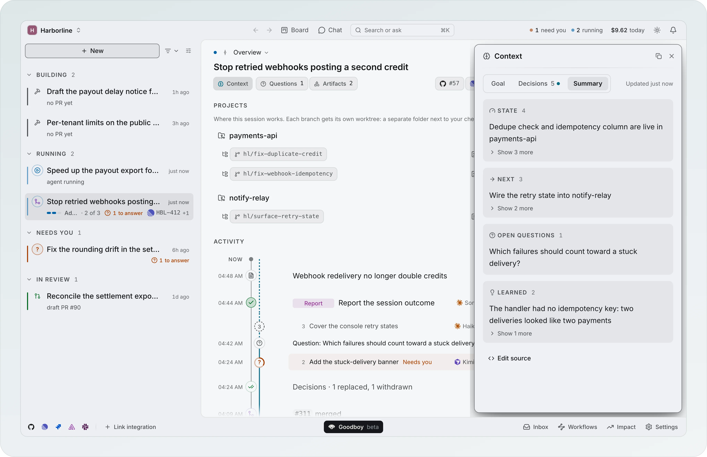
</picture>

Hand the next agent where things stand. After each turn a summary is updated with **State**, **Next**, **Open questions** and **Learned**, and an edit you made in the meantime is kept. Each block shows its key line first and folds the rest behind **Show 3 more**.

### Context drawer

<picture>
  <source media="(prefers-color-scheme: dark)" srcset="./docs/readme/context-drawer-dark.webp">
  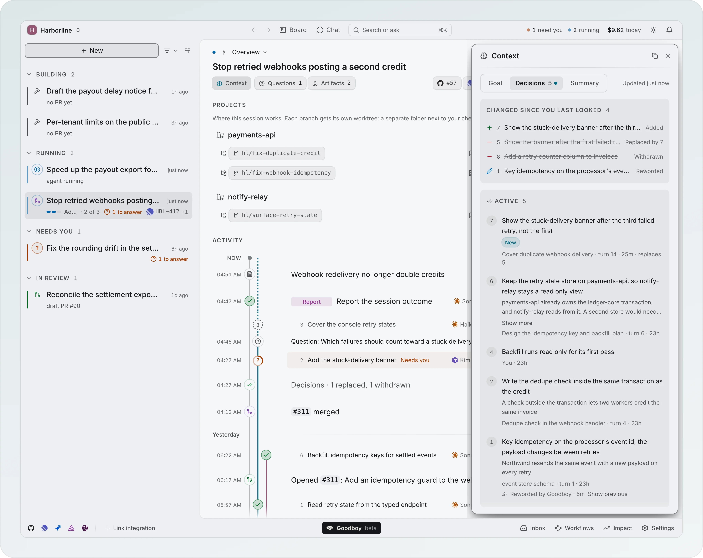
</picture>

Open goal, decisions and summary from any session page with the **Context** button, and use the copy icon at the top for **Copy as brief**. A dot on **Decisions** says something changed since you last looked, and **Changed since you last looked** lists added, removed and reworded decisions first. Active decisions show their reason under the text when they have one.

### Context budgets

Keep prompts small as a session grows. Each part of the shared brief has its own size, and when decisions run over, the newest are kept.

### Plans handed to the next agent

Hand a plan straight to the implementer. The plan goes from **Ready to run** to **Ran** and shows which agent used it.

## Providers, limits and cost

<picture>
  <source media="(prefers-color-scheme: dark)" srcset="./docs/readme/s15-limits-dark.webp">
  
</picture>

### Usage limits chip

See how much of your Claude and Codex plans is left before a run stops. A top-bar chip draws the 5-hour window and the week as two bars: amber from 80%, red and full at 100%, faded when the figures are old. Hover it for the percentages and when each window comes back. Checking Claude spends no model tokens: Goodboy runs Claude's own `/usage` in an empty folder.

### Use reset

<picture>
  <source media="(prefers-color-scheme: dark)" srcset="./docs/readme/s16-codex-reset-dark.webp">
  
</picture>

Spend a free Codex reset at the right moment. When Codex offers one, the usage page shows it with its expiry and **Use reset**, and Goodboy warns you when spending it now would waste it.

### Fallback when a limit is hit

Keep a task moving when a provider runs out. With another eligible provider connected, the turn can move there, and the chat records where it went.

### Fallback order and Auto

Choose where **Auto** starts and the order it falls back through, with an Auto model for each role.

### Model picker

Pick a model with the reason next to it: **Auto**, a suggested model with its price ratio, the last one used, and family and effort chips. You choose which models appear.

### Impact

See what Goodboy got done and what it cost over 7 days, 30 days or all time, opening on one sentence built from your numbers.

### Monthly cap and budget alert

<picture>
  <source media="(prefers-color-scheme: dark)" srcset="./docs/readme/s24-impact-dark.webp">
  
</picture>

Set a monthly cap per provider and hear about it before you reach it. Past the threshold Goodboy routes the next turn to another provider with room, and if none has room, work continues where it is.

## Storage

<picture>
  <source media="(prefers-color-scheme: dark)" srcset="./docs/readme/s25-storage-dark.webp">
  
</picture>

### Worktree folders

Free disk space without guessing: worktree folders by repo, with their size, why each exists and whether it is safe to remove. Folders with changes, running agents or a git operation in progress are skipped, with the reason.

### Branches

<picture>
  <source media="(prefers-color-scheme: dark)" srcset="./docs/readme/s33-branches-dark.webp">
  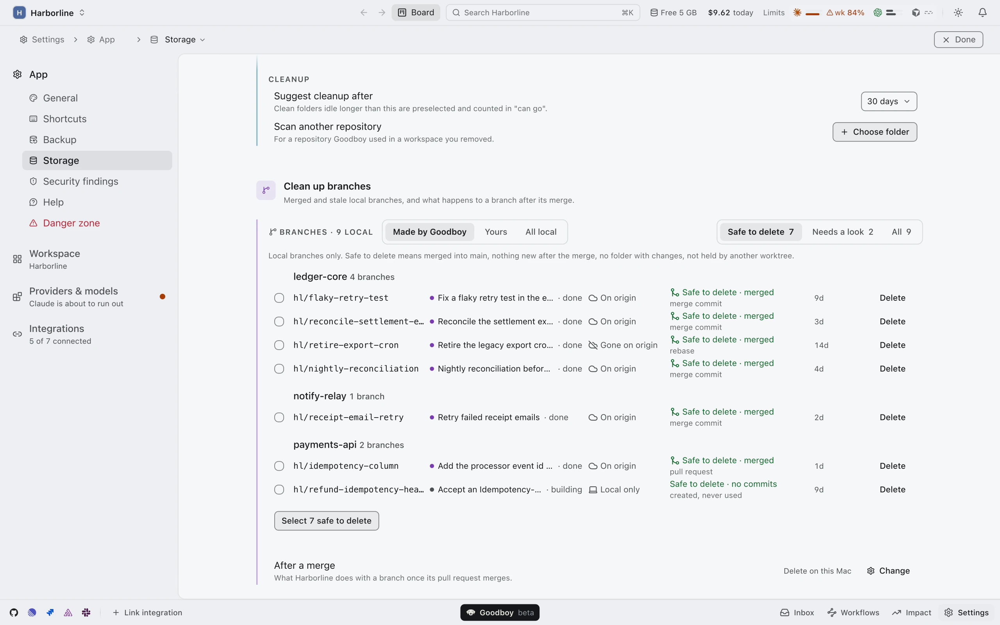
</picture>

Delete old branches with confidence. They are sorted into **Safe to delete** and **Needs a look**, each with its session and whether it still exists on origin, and squash-merged branches are spotted too.

### Storage scope

Clean up this workspace, other workspaces, removed ones or all of them, each with its weight, from the picker in the page header. Bulk actions name the scope they act on. The page reads as two groups: **Free up space** and **Clean up branches**.

### Free space chip

See reclaimable space at a glance. While at least 1 GB of worktree folders can go, the top bar shows **Free N GB**, and a click opens Storage at the folders.

### Artifacts from deleted sessions

Decide what to keep from sessions you deleted: their plans, reports and wireframes, with **Keep** or **Delete**.

### Goodboy can free N GB

Hear about reclaimable space once, when idle safe folders pass 10 GB or the disk runs low. After a notice it waits 14 days and another 10 GB before speaking again.

## Security, backup and updates

<picture>
  <source media="(prefers-color-scheme: dark)" srcset="./docs/readme/s26-security-dark.webp">
  
</picture>

### Security findings

Catch a token pasted into a saved script before it travels. Saving a script checks it for keys and tokens, and findings show in **Settings**, **App**, **Security findings**, where **Not a secret** dismisses one and **Flag again** brings it back.

### Findings kept out of the export

Move your setup to a new machine without carrying a flagged token: an export leaves out the script that holds it, unless you include it on purpose.

### Export and import your setup

Move workspaces, projects, workflows, scripts, rules and preferences to another machine, in groups. Import shows what it adds before writing, keys and sign-ins stay out of the export, and imported integrations ask you to sign in again.

### Backup before a data update

Update without worrying about your data. Before an update changes it, Goodboy makes a full copy and keeps the last two, and if the copy fails, the update does not start.

### Newer data guard

Open an older Goodboy on newer data without damage: it stops and offers **Restore backup** or **Quit**.

### Updates

Get updates in the background, then see what is new. With agents running, **Restart when they finish** waits for them.

### Changelog in the app

Read release notes inside the app, searchable, with links into the screen each change touched. Before an update, "What's new" shows every release it brings, marked **In the update**. After an update, "What's new since" covers the releases you skipped. In the list, only releases that update your data in one direction carry a mark.

### Before and after pictures

See a change instead of reading about it. Release notes can show **Before** and **After** pictures, with a lightbox, in light and dark.

### Guide

Learn how Goodboy works in 18 short chapters that follow a task, with search and links that open each screen. Open **Guide** from the palette.

## Agents

<picture>
  <source media="(prefers-color-scheme: dark)" srcset="./docs/readme/s09-transcript-dark.webp">
  
</picture>

### Workspace chat

<picture>
  <source media="(prefers-color-scheme: dark)" srcset="./docs/readme/s34-chat-dark.webp">
  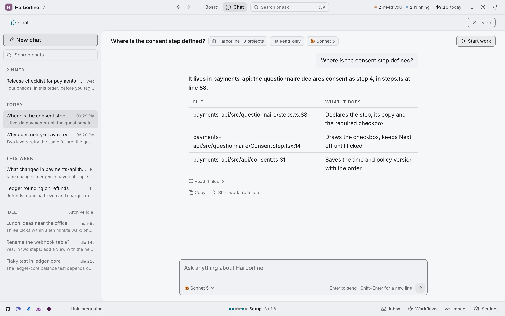
</picture>

Ask about the workspace without starting a session. **Chat**, right of **Board**, opens a list of your chats next to one conversation. Each chat reads every project of the workspace and never changes a file: the answer streams in, **Read N files** lists what it opened, and the model is picked per chat, from Claude or Codex, the two providers that can be held to reading. Chats you have not used for seven days move to **Idle**, dimmed, and **Archive idle** clears them with an **Undo**. Nothing is archived for you.

**Start work** turns a chat into work in a panel beside it: the chat's model drafts a title, a goal, what the chat established and the files it named, you edit any of it, then start a new session with that goal or send it into a session that is already running.

### Roles

Give each agent the job it is good at. Nine roles come with the app, **Scout**, **Debug**, **Plan**, **Implement**, **Review**, **Test**, **Resolve**, **Docs** and **Generalist**, and a role sets the agent's instructions, its default model and what it hands back.

### What the agent received

Check exactly what an agent was told. The top of each chat shows who sent it and a chip for each part of its brief, and **View as sent** shows the exact text, with Copy.

### Agent transcript

Follow one agent's work: grouped file edits, questions, permission cards and chips for the plans and reports it writes.

### Queue or send now

Keep talking while an agent works. **Enter** queues your message for its next turn, **⌘Enter** interrupts and sends it now, and the queue survives a restart.

### Stop and Continue

Stop an agent without losing its work. Stopping keeps what it wrote and offers **Continue**. An agent that was working when you reload, restart or update Goodboy keeps going: a reload finds it still running, and after a restart it picks up where it stopped, with a note in its chat. One that cannot pick up says **Stopped by restart** and offers **Resume**.

### Turn footer

See what each turn cost: provider, model, duration, tokens, cache share, estimated cost and a context meter.

### Tool call states

Tell at a glance what a tool call did: **Running**, **Done**, **Failed**, **Needs approval**, **Stopped** or **Denied**, with elapsed time and readable input and output.

### Composer plus menu

Do more from the message box: attach files, run a script (`$`), start a workflow (`~`) or ask another agent (`@`). `$` lists your saved scripts and your `package.json` scripts, across pnpm and yarn workspaces.

### Attach files

Hand an agent images, PDFs, CSV and text files, up to 10 at a time, by paste, drop or pick.

### Drift warning

Hear about it when an agent steps outside its role, like a planner editing files. Goodboy checks each turn against the role and sends a notification.

### Subagents from plan parts

Run a plan part by part. An implementer given a plan splits into one sub-agent per part, shown as 3.1 and 3.2, and a plan can give each part done-when checks and the files it expects to touch.

### History rewriter and Scribe

Let two helpers work on your history and your pull request text without the power to push. Their git points at a push address that goes nowhere, and their GitHub tokens are removed.

### One language per session

Get agents and summaries in the language of your goal.

## Support Goodboy

The best support is running Goodboy on the work you already have. When something feels off, or you have an idea, report it from inside the app in one line.

<picture>
  <source media="(prefers-color-scheme: dark)" srcset="./docs/readme/s32-report-bug-dark.webp">
  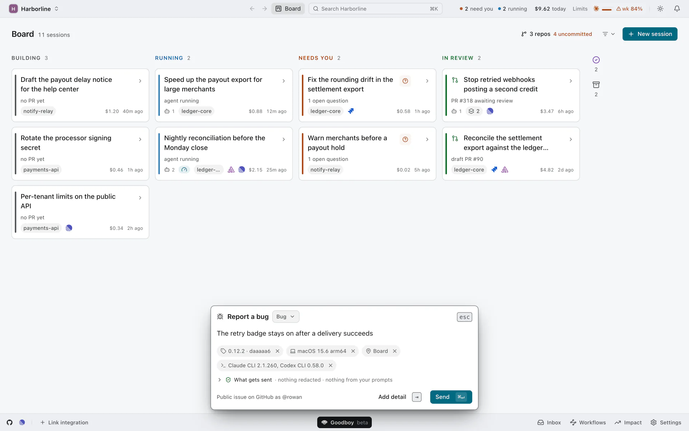
</picture>

### Report a bug

Tell us what broke in one line. **⌘I** (**Ctrl+Shift+I** on Windows and Linux) opens a report sheet from any screen, and so do the footer chip, the palette, Settings, the macOS Help menu and **Report this** on a notification. Version, system, screen and CLI versions come along as chips you can remove, **What gets sent** shows exactly what leaves, and secrets, paths and emails are stripped. It files through gh, or opens the issue on GitHub. After a crash, the next launch offers to report it.

<h2>Keyboard and terminal</h2>

### Terminal

Open a real login shell in the session's worktree with **⌘T**, and find it still there after a reload. **⌘F** finds in its scrollback.

### Keyboard shortcuts, back and forward

Drive Goodboy from the keyboard: about 40 shortcuts, a key for each view, workspaces 1 to 9, and **⌘[** and **⌘]** through history. One registry drives the keys, the help screen and the tooltips. **Esc** closes what is open inside the app and never takes the window out of macOS full screen.

### Script drawer

Watch a script's live output with **Stop**, **Run again** and the exit code, and pick it back up after a reload.

### Open in editor

Jump into VS Code, Cursor, Zed, the JetBrains IDEs, Sublime Text, Vim or Neovim, at the worktree or the file. VS Code and Cursor open it in the window you already have.

### Explore

Browse the session folder as a file tree with previews, and **Ask an agent about this file**.

## Also there

| Feature            | What it does for you                                                                     |
| ------------------ | ---------------------------------------------------------------------------------------- |
| Written by Goodboy | Comments Goodboy posts end with a line that says so, and a setting turns it off          |
| Resolve again      | Rereads a comment and tries the fix once more                                            |
| Checks             | The pull request's checks with durations, and a failed one becomes a **Next** suggestion |
| Settings rail      | Each settings area says what needs you, like folders not found                           |
| Update pill        | A single light sweep when an update is ready                                             |
