# Goodboy features

The full feature guide, in the order a task lives: set up, start, run, review, ship, clean up. Each entry says what it does for you, and sometimes how.

- [Set up](#set-up)
- [Start a task](#start-a-task)
- [The board](#the-board)
- [Inside a session](#inside-a-session)
- [Agents and chat](#agents-and-chat)
- [Workflows](#workflows)
- [Shared context](#shared-context)
- [Inbox and your tools](#inbox-and-your-tools)
- [Plans, reports and wireframes](#plans-reports-and-wireframes)
- [Review, resolve and pull requests](#review-resolve-and-pull-requests)
- [Branch history](#branch-history)
- [Providers, limits and cost](#providers-limits-and-cost)
- [Storage](#storage)
- [Security, backup and updates](#security-backup-and-updates)
- [Keyboard and terminal](#keyboard-and-terminal)
- [Also there](#also-there)

## Set up

<picture>
  <source media="(prefers-color-scheme: dark)" srcset="./docs/readme/s23-onboarding-dark.webp">
  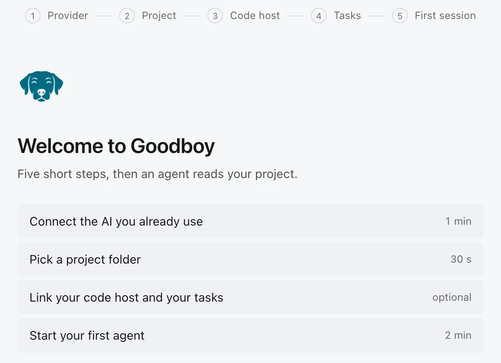
</picture>

### Welcome to Goodboy

Go from install to a first agent reading your repo in a few short steps. Steps that do not apply to you are skipped, and the last one hands you a session draft already filled in.

### Provider connection

Connect each provider the way it supports, with a login you already have or an API key. A connect card walks you through it, and **Open the sign-in page again** helps when no browser tab opened.

### One page per provider

Find usage, the models in your picker, permissions and your account on one page per provider. Providers billed per token say so instead of showing usage windows.

### Update the provider CLI

Find out when a model needs a newer CLI, and update it from the provider page once running turns finish. A turn the CLI refuses retries on the closest model in the same family.

### Permissions for each provider

See which permission modes a provider can honor before you pick one: **Read only**, **Ask first**, **Edits allowed** and **Full access**, each marked as working, partly working or not available, with the reason. A mode a provider cannot honor runs as a stricter one, so **Ask first** on Codex runs as **Read only**.

### Workspace with several projects

Keep your repos together as one workspace, and let one session work across several of them. A project gets a branch only when an agent needs to edit it, and the timeline records why.

### Starred projects, descriptions and base branch

Point agents at the right repo without naming it. Starred projects and their one-line descriptions go into each agent's brief, and each project shows its base branch, read from origin.

### Open in new window

Give each workspace its own window, so switching does not interrupt running agents. A workspace that is already open brings its window forward instead of opening twice. After a reload or an update, and on every launch with **Reopen last** on, every window comes back on the screen, tab and panel it showed.

### Locate moved projects

Moved your repos to a new folder? Pick the parent folder and Goodboy finds them, fixes the stored paths and repairs the worktrees, with **Undo move**. Repos are matched by their first commit and remote, not by folder name.

### Workspace switcher and Reconnect

Jump between workspaces and projects from one search. Disconnecting a workspace keeps its history, and adding its folder again offers **Reconnect**.

### Keep .goodboy out of git

Keep Goodboy's own folder out of your commits with one click. The card shows up only when git does not already ignore `.goodboy`, your global rules included.

### Repo status across projects

See which repos are behind, uncommitted or diverged from the board's **N repos** popover, and update the safe ones together. Updates are fast-forward only and leave dirty or diverged repos to you.

### Integrations

Connect GitHub, GitLab, Bitbucket, Linear, Jira, Sentry and Slack from one settings page, and give a project a different account than its workspace when you need to. Keys go in your system credential store.

### About you

Tell agents once who you are and how you like to work, in four short parts. **See who reads what** shows which role reads each part.

## Start a task

<picture>
  <source media="(prefers-color-scheme: dark)" srcset="./docs/readme/s02-kickoff-dark.webp">
  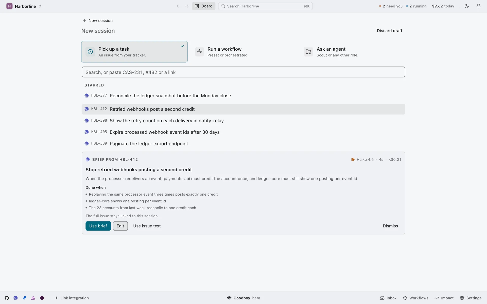
</picture>

### How do you want to start?

Start from an issue, a workflow or a question, in one draft with three tabs: **Pick up a task**, **Run a workflow** and **Ask an agent**. The draft becomes a session only when you press Start, so empty sessions do not pile up.

### Start blank

Start from the goal instead: **Start blank** in the kickoff header opens the session straight on its Overview, and you add the goal, projects and work from there.

### Pick up a task, with a drafted brief

Turn an issue into a briefed session in one pick. Goodboy drafts a short title and goal linked back to the issue, and you keep it, edit it, or use the issue text.

### Ask an agent

Map an unfamiliar repo before you plan: **Scout** is the default and can start with an empty prompt. On a broad question the scout can split the search by area, and one report merges what the child scouts found.

### Run a workflow

The full workflow builder, right in the kickoff: pick **Orchestrated**, **Custom** or **Preset**, see the plan you will run, edit the steps, choose which providers it can use, and set Starts, Autorun and a spend cap. **Start workflow** creates the session and starts the run in one step.

### Named by Goodboy

Get a short title without writing one. A new session is named for you and marked "Named by Goodboy" until you rename it.

## The board

<picture>
  <source media="(prefers-color-scheme: dark)" srcset="./docs/readme/s01-board-dark.webp">
  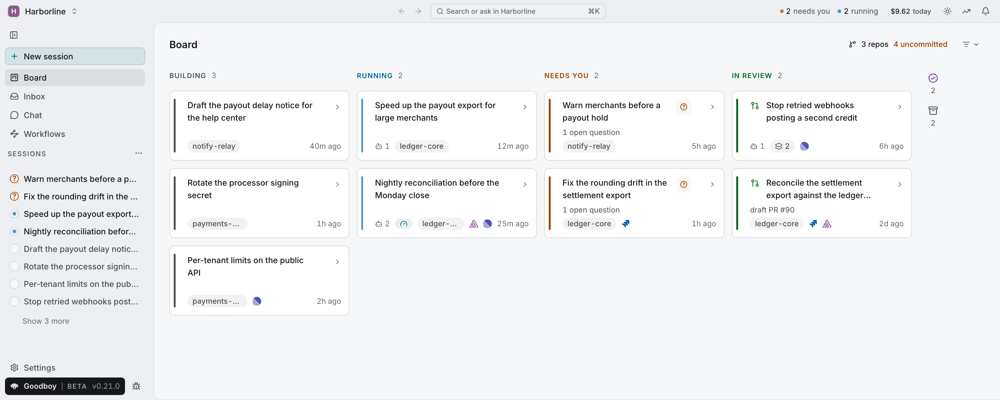
</picture>

### Stage board

See where each task stands without moving cards around. Each session sits in **building**, **running**, **needs you**, **in review** or **done**, based on what is happening in it.

### Session card

Read a task at a glance: pull request, issue and project chips, step progress, agent count, age and cost, plus one suggested action.

### Done and Archived dock

Keep finished work out of the way but close by. Done and archived sessions fold into two icons at the side of the board, and hovering previews them.

### Bulk select

Tidy many sessions at once. Lasso or modifier-click cards across columns, then archive, restore or delete them together.

### Now chip

Know what needs you from any screen. A top-bar chip counts sessions that need you, running sessions and running scripts.

## Inside a session

<picture>
  <source media="(prefers-color-scheme: dark)" srcset="./docs/readme/s03-activity-dark.webp">
  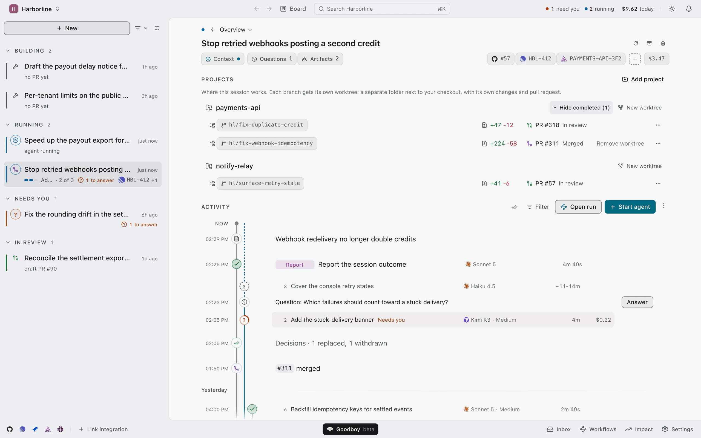
</picture>

### Session overview

Find the goal, linked issues, projects, cost and the buttons to start an agent or a workflow on one screen. **Run workflow** turns into **Open run** while a run is live, so a second one does not start on top.

### Refresh a session

See pull requests made outside Goodboy without reloading. One an agent opened or you made in a terminal shows up when the turn ends or when you come back to the window. **Refresh**, next to Archive and Delete in the session header, re-reads projects, branches and pull requests right away, also from **⌘⇧R** and the command palette.

### Activity

Read the whole session as one timeline of agents, workflows, questions, fixes, artifacts, pull requests and decisions. Each step shows provider, model, time and cost in the same columns.

### Next

Know the one move that unblocks a task, like answering a question, fixing a failing check or opening a pull request. **Not now** puts it away until the situation changes.

### Time left

See how long a step has left, learned from your own past runs. Queued steps show a range, a slow run says "Longer than usual", and thin history shows a count instead of a guess.

### File versions

Undo an agent's edit in a session without a branch: each file it changed is kept as it was, with **Restore**.

### Worktrees

<picture>
  <source media="(prefers-color-scheme: dark)" srcset="./docs/readme/s10-projects-dark.webp">
  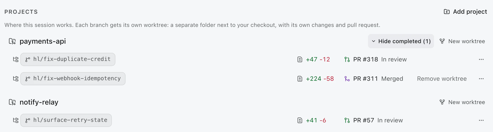
</picture>

Let agents edit in parallel without touching your checkout. When an agent needs to edit a repo, that work gets its own worktree and branch.

### Several branches per project

Work on several branches of one repo in the same session. If a worktree drifts to another branch, Goodboy offers **Use this branch here** or **Keep both branches**.

## Agents and chat

<picture>
  <source media="(prefers-color-scheme: dark)" srcset="./docs/readme/s09-transcript-dark.webp">
  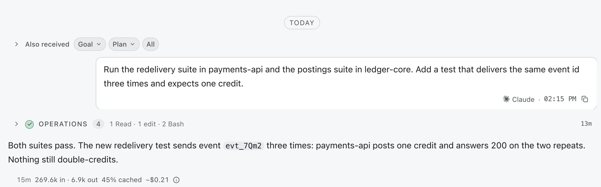
</picture>

### Roles

Give each agent the job it is good at. Nine roles come with the app, **Scout**, **Debug**, **Plan**, **Implement**, **Review**, **Test**, **Resolve**, **Docs** and **Generalist**, and a role sets the agent's instructions, its default model and what it hands back.

### What the agent received

Check exactly what an agent was told. The top of each chat shows who sent it and a chip for each part of its brief, and **View as sent** shows the exact text, with Copy.

### Agent chat

Follow one agent's work: grouped file edits, questions, permission cards and chips for the plans and reports it writes.

### Queue or send now

Keep talking while an agent works. **Enter** queues your message for its next turn, **⌘Enter** interrupts and sends it now, and the queue survives a restart.

### Stop and Continue

Stop an agent without losing its work. Stopping keeps what it wrote and offers **Continue**. An agent that was working when you reload, restart or update Goodboy keeps going: a reload finds it still running, and after a restart it picks up where it stopped, with a note in its chat. One that cannot pick up says **Stopped by restart** and offers **Resume**.

### Turn footer

See what each turn cost: provider, model, duration, tokens, cache share, estimated cost and a context meter.

### Tool call states

Tell at a glance what a tool call did: **Running**, **Done**, **Failed**, **Needs approval**, **Stopped** or **Denied**, with elapsed time and readable input and output.

### Composer plus menu

Do more from the message box: attach files, run a script (`$`), start a workflow (`~`) or ask another agent (`@`). `$` lists your saved scripts and your `package.json` scripts, across pnpm and yarn workspaces.

### Attach files

Hand an agent images, PDFs, CSV and text files, up to 10 at a time, by paste, drop or pick.

### Drift warning

Hear about it when an agent steps outside its role, like a planner editing files. Goodboy checks each turn against the role and sends a notification.

### Subagents from plan parts

Run a plan part by part. An implementer given a plan splits into one sub-agent per part, shown as 3.1 and 3.2, and a plan can give each part done-when checks and the files it expects to touch.

### History rewriter and Scribe

Let two helpers work on your history and your pull request text without the power to push. Their git points at a push address that goes nowhere, and their GitHub tokens are removed.

### One language per session

Get agents and summaries in the language of your goal.

## Workflows

<picture>
  <source media="(prefers-color-scheme: dark)" srcset="./docs/readme/s05-workflow-builder-dark.webp">
  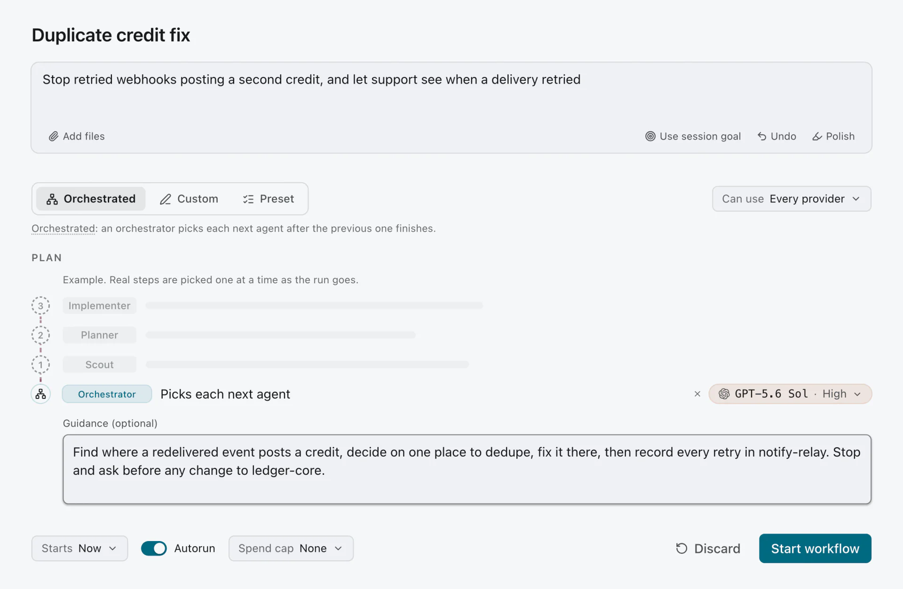
</picture>

### Workflow builder

Shape a run before it starts: a name, a goal and a mode, with the plan previewed as the tree the run will show.

### Orchestrated

Give a goal and let a model pick each next step, with its role, provider, model, effort and a reason, until it says done or blocked.

### Hints to the orchestrator

<picture>
  <source media="(prefers-color-scheme: dark)" srcset="./docs/readme/s04-workflow-run-dark.webp">
  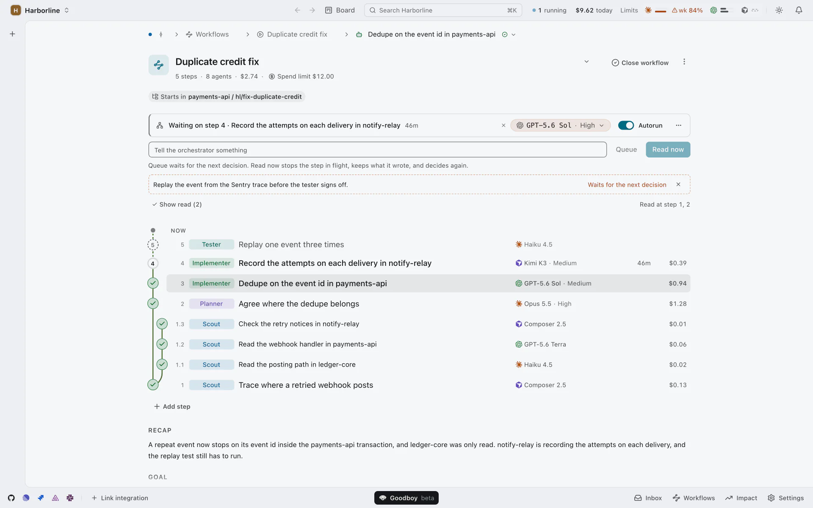
</picture>

Steer a run while it goes. **Queue** waits for the next decision, and **Read now** stops the step in flight, keeps what it wrote and decides again.

### Why each step, and the run recap

See why each step was picked, and a short recap of what is done and what is left, rewritten after each decision.

### Preset and Custom

Write the steps yourself, press **Draft with planner**, or start from a saved workflow. **Save as preset** keeps what you changed.

### Built-in workflows

Start from **Refactor**, **Plan and ship** or **Fix a bug**. A built-in you delete stays deleted until you press **Restore built-in workflows**.

### Saved steps

Reuse steps across workflows. The 8 built-in steps are read-only, and **Save a copy** makes your own.

### Model per step

Put a light model on a scout and a strong one on the planner. Each step has its own provider, model and effort, and Goodboy records what actually ran.

### Autorun

Let a run move to its next step without you, per run or for the whole session. A guard stops an agent after 4 unattended turns in an hour, and anything you write to it resets the count.

### Spend limit

Cap what a run or a session can spend, and choose **Pause workflows** or **Only warn me**. A paused run offers **Raise limit**.

### Chained starts

Line work up behind work: start a run now, by hand, or after another run finishes.

### Workflow run

Follow a run as a tree with one pinned next action, and add steps to a live or finished run. Deleting a run deletes its agents and their open questions with it.

### Step handoff summary

Start each step from a short brief instead of the whole previous chat. If the summary fails, Goodboy keeps the start and end of the chat and marks the brief as degraded.

### Open questions

<picture>
  <source media="(prefers-color-scheme: dark)" srcset="./docs/readme/s07-questions-dark.webp">
  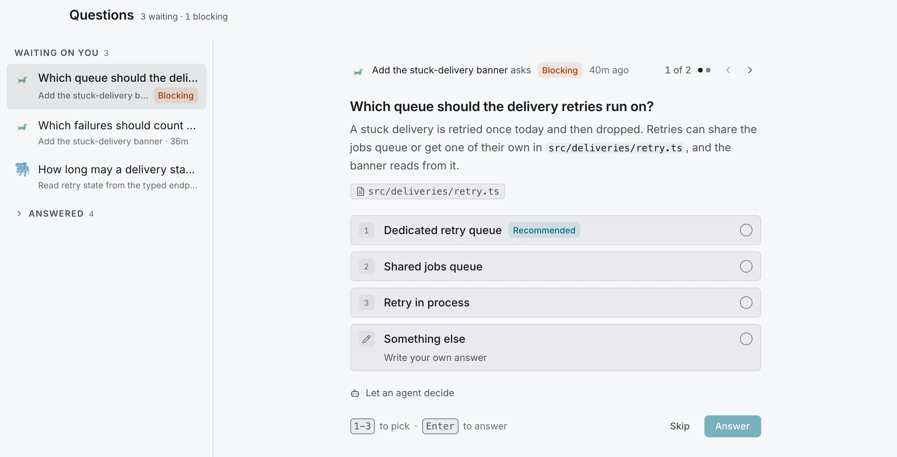
</picture>

Get questions as cards instead of lines buried in a chat. An agent can mark a question as blocking, which holds its step until you answer, and a question can include suggested answers next to free text.

### Let an agent answer

Hand a question to another agent with a hint and a model, and its answer counts as yours. **Answer it yourself** takes it back.

### Import workflows

Bring custom workflows over from your other workspaces.

## Shared context

<picture>
  <source media="(prefers-color-scheme: dark)" srcset="./docs/readme/s08-context-dark.webp">
  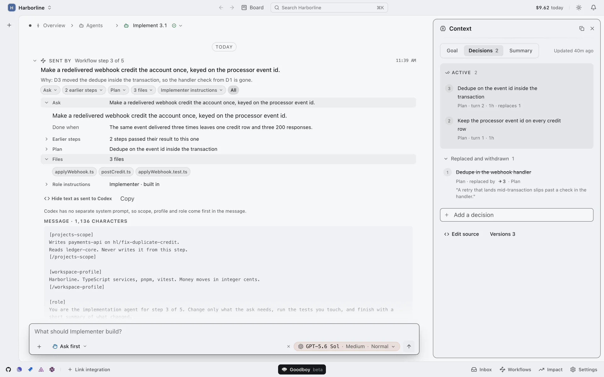
</picture>

### Decisions

Record a decision once and have the agents after it read it. Each one gets a number and a byline, and replacing or withdrawing it needs a reason that stays next to it.

### Running summary

Hand the next agent where things stand. After each turn a summary of **State**, **Next** and **Learned** is updated, and an edit you made in the meantime is kept.

### Context drawer

Open goal, decisions and summary from any session page, with **Copy as brief**. A dot on **Context** says something changed since you last looked, and the drawer lists added, removed and reworded decisions first. Each tab reads as labelled blocks, the key line first and the rest folded.

### Context budgets

Keep prompts small as a session grows. Each part of the shared brief has its own size, and when decisions run over, the newest are kept.

### Plans handed to the next agent

Hand a plan straight to the implementer. The plan goes from **Ready to run** to **Ran** and shows which agent used it.

## Inbox and your tools

<picture>
  <source media="(prefers-color-scheme: dark)" srcset="./docs/readme/s20-integrations-dark.webp">
  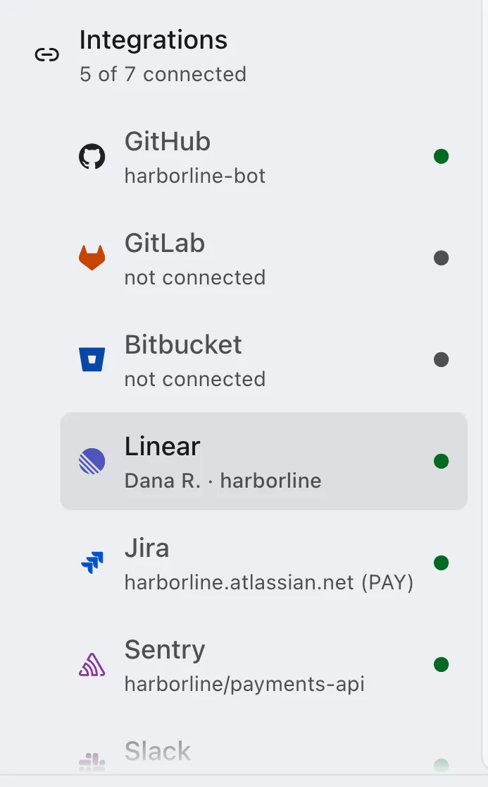
</picture>

### Supported tools

Connect the ones you use. Each one feeds the Inbox and can start a session with its brief drafted.

- **GitHub**: issues and pull requests, review comments you resolve with an agent, and the pull request page
- **GitLab**: issues and merge requests, with threaded discussions, replies, approvals and merge
- **Bitbucket**: pull requests, with comments, approvals and merge
- **Jira**: issues you comment on, assign, edit and move between statuses
- **Linear**: issues you comment on, assign, edit and move between states, with threaded replies
- **Sentry**: errors with stack trace, breadcrumbs and tags, ready to hand to an agent
- **Slack**: threads from the channels you pick, where agents read, reply and react, and replies wait for your OK by default

### Agents use your tools

Let agents on any provider read and act on GitHub, GitLab, Bitbucket, Jira, Linear, Sentry and Slack, as far as you connected them, without handing them your keys. The agent asks Goodboy over a local socket only your user can open, and Goodboy makes the call.

### Inbox

<picture>
  <source media="(prefers-color-scheme: dark)" srcset="./docs/readme/s19-inbox-dark.webp">
  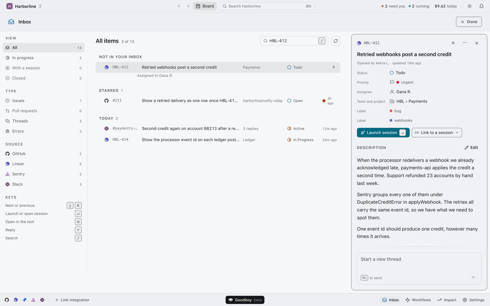
</picture>

Work from one list instead of seven tabs: issues, Slack threads and Sentry errors from your connected tools, plus pull requests from GitHub (review requests and your own recent ones) and merge requests from GitLab and Bitbucket, grouped by day, with keyboard navigation. Sentry errors filter by the project they belong to, and GitHub or GitLab items too when several projects live on that host. Linear and Jira stay one flat list.

### Find any issue by code or link

Paste `HBL-412`, `#318` or a link and open the issue, even when it is not assigned to you. An unknown prefix is tried on Linear and Jira at once.

### Starred issues

Keep the issues you follow on top of the Inbox and of **Pick up a task**.

### Launch a session from any item

Start a session from an issue, a Slack thread or an error, with the brief already drafted. A Sentry error or a GitHub or GitLab item opens in its project, and the popover says why.

### Link an item to a session

Attach an inbox item to work that already exists. **Link to a session** sits next to **Launch session** and links the task to the session you pick. From a session, paste an issue code or a link into the Overview link picker to find the issue and link it.

### Trackers

Comment, assign, edit and move issues in Linear and Jira, and read Sentry errors with stack trace and breadcrumbs, inside Goodboy.

### Code hosts

Work on GitHub pull requests and issues, GitLab merge requests, and Bitbucket comments, approvals and merges without leaving Goodboy. GitHub and GitLab can work side by side, one for code and one for tickets.

### Slack: what agents can do

<picture>
  <source media="(prefers-color-scheme: dark)" srcset="./docs/readme/s21-slack-dark.webp">
  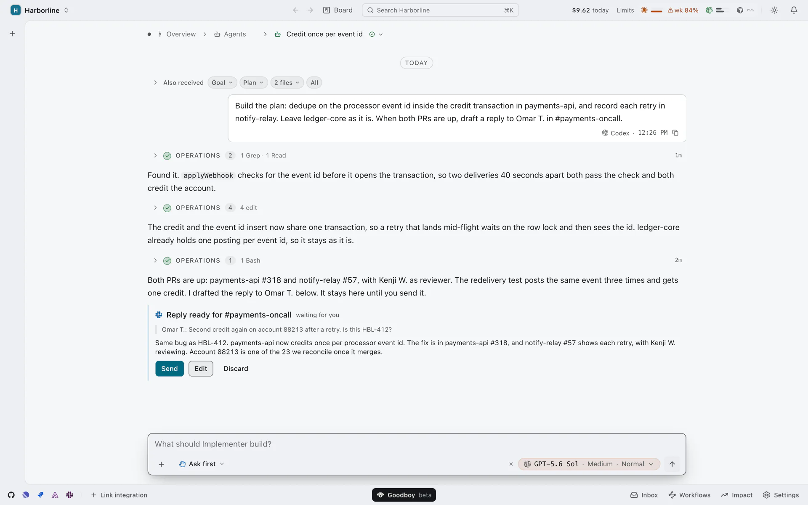
</picture>

Decide how far agents go in Slack: pick the channels, then whether they read threads, reply and react. Replies default to **Ask me first**, and agents do not start new conversations or send direct messages.

### Reply ready for #channel

Approve what goes out in Slack from where you already are. Under **Ask me first**, a reply waits as a card with **Send**, **Edit** and **Discard**.

### Slack signature

Let people in a thread see when an agent wrote a reply. Replies agents post directly carry a short note, "Written with Goodboy" by default.

### Images from your tools

See screenshots attached in Linear, Jira and GitHub inside Goodboy. Your key goes only to that tool's own image host.

### Records read the same way

Read items from any tool the same way: one list of labels and values, with who opened them and when.

### Comment threads

Follow replies under the comment they answer, in Linear and GitLab, and **Reply** into that thread.

## Plans, reports and wireframes

<picture>
  <source media="(prefers-color-scheme: dark)" srcset="./docs/readme/s11-plans-dark.webp">
  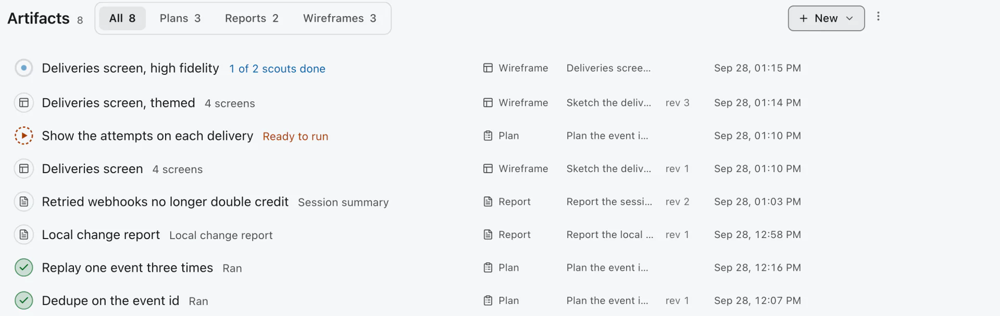
</picture>

### Artifacts

Keep plans, reports and wireframes next to the task instead of in a chat, with who made each one and what it was built from.

### Plan parts and Run plan

Check a plan before it runs. A plan can give each part done-when checks and the files it expects to touch, and **Run plan** turns each part into a sub-agent.

### Report as a document

<picture>
  <source media="(prefers-color-scheme: dark)" srcset="./docs/readme/s14-report-dark.webp">
  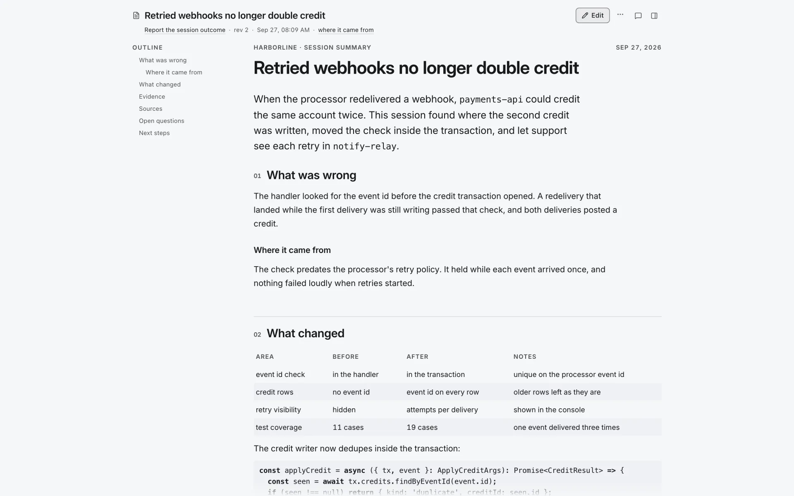
</picture>

Read a report as one document with an outline, and open the same file in a browser on another machine.

### Files on disk

Open any artifact as a folder, in your browser or your file manager. The folder is rewritten on each revision and follows renames.

### Wireframes scouted first

Get wireframes that start from your code. Before drawing, two scouts read the repo, one for screens and one for data, and each claim they make has to cite a file that exists.

### Wireframe versions

<picture>
  <source media="(prefers-color-scheme: dark)" srcset="./docs/readme/s13-compare-dark.webp">
  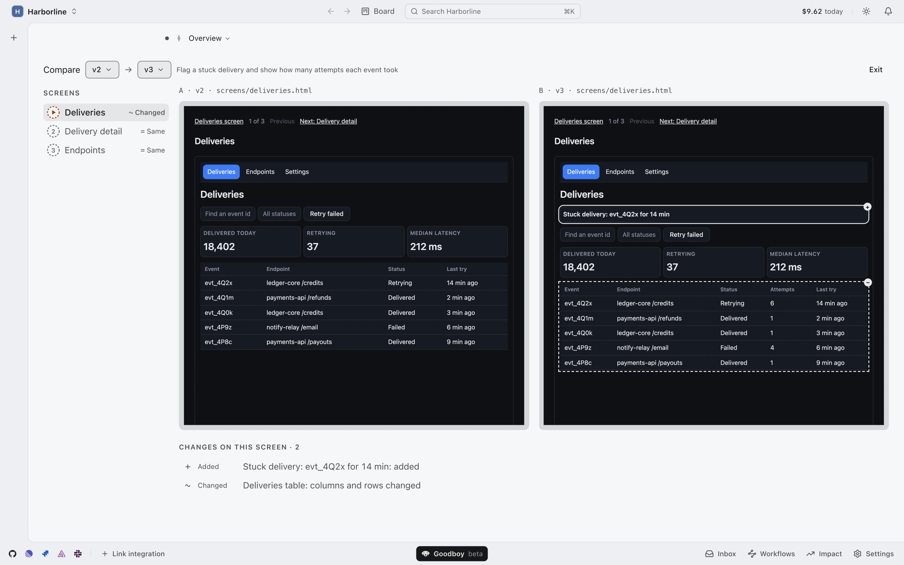
</picture>

Go back to any wireframe version with **View**, **Compare** and **Restore**.

### Compare

See what changed between two wireframe versions side by side, with a change list that lights up each element in both frames.

### Ask for a change

Point at what you want changed: pick elements on the wireframe, choose this screen or all screens, and ask.

### Import wireframe JSON

Bring in a wireframe made elsewhere, with a preview of any fixes before it lands.

### Revisions and Restore

Bring back an earlier plan, report or wireframe as a new revision, with its author, without losing the later ones.

### Save a copy and New variant

Export a wireframe as a folder of pages, or redraw it at the other fidelity.

## Review, resolve and pull requests

<picture>
  <source media="(prefers-color-scheme: dark)" srcset="./docs/readme/s12-resolve-dark.webp">
  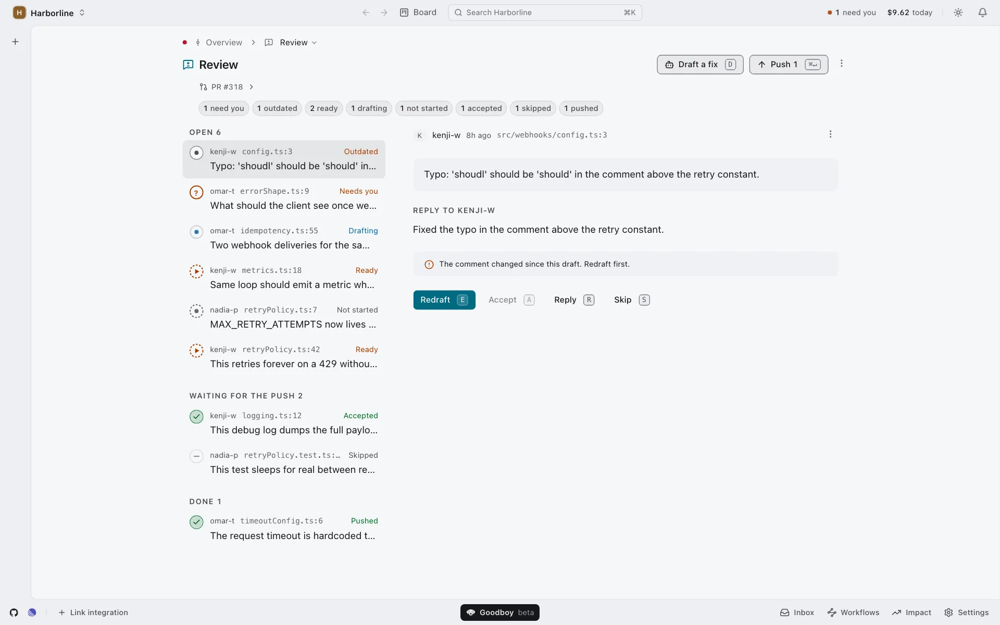
</picture>

### Resolve

Turn review comments into commits without writing the fix yourself. Select comments, press **Resolve** and pick a model: an agent writes each fix as a local commit and drafts the reply, and you approve, ask for a revision, or mark it **Will not fix**.

### Comment states

Know what each comment needs next. Each one shows a state like **Working**, **Needs you**, **Reply ready** or **Approved**, grouped by file.

### Close on GitHub

Finish a review in one action: push the fixes, post the replies and resolve the threads. After an interruption Goodboy looks for your reply in the thread before posting it again.

### Review replies in your voice

Get replies that sound like you, **Terse**, **Friendly**, **Formal** or **Like my replies**. **Like my replies** reads your last 20 review replies and writes a style note you can edit.

### Fixes on a branch that moved

Approve a fix even after the branch got new commits: it lands on top of the latest one, and on a conflict the branch goes back to its old head.

### Notes before a pull request

Review your own diff before anyone else does. Leave notes, resolve them like review comments, and post the open ones to the pull request later.

### GitHub pull request page

Know whether a GitHub pull request can merge, in plain words, with details, checks and activity, and merge, mark ready, draft or close it from there. **Merge** asks for confirmation.

### Write it for me

Get a pull request title, description and changelog entry in your repo's format when you open a pull request. Linked issues become closing references.

### PR description follows the push

Keep a pull request description in step with its branch. After a history push, a description Goodboy wrote is updated to match, unless you edited it.

### Diff

<picture>
  <source media="(prefers-color-scheme: dark)" srcset="./docs/readme/s17-diff-dark.webp">
  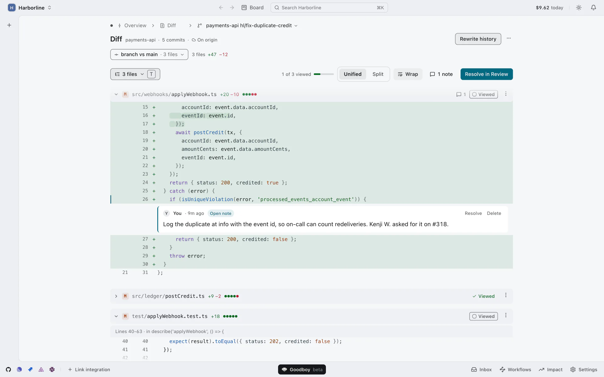
</picture>

Read changes with syntax colors, word-level highlights, split or unified view and a **Viewed** tick per file, and quote a line into a note or a question for an agent.

### Write review

Draft line comments on a GitHub pull request and publish them with **Comment**, **Approve** or **Request changes**. Outdated drafts are marked **Stale**.

## Branch history

<picture>
  <source media="(prefers-color-scheme: dark)" srcset="./docs/readme/s22-history-dark.webp">
  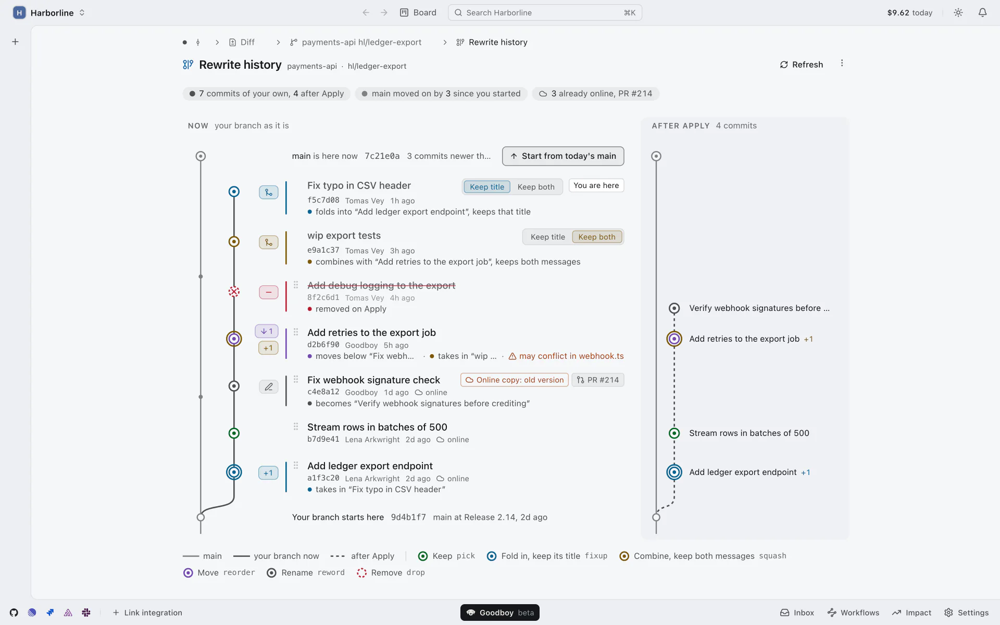
</picture>

### Rewrite history

Clean up a branch without holding your breath: reword, squash, drop or reorder commits, then **Apply**. The plan is replayed in a throwaway copy, and your branch moves only when the replay comes out clean.

### Conflict prediction

See which files would conflict while you edit the plan, or read "No conflicts expected". The plan is merged in memory, so your checkout stays as it is.

### Conflicts merged in a copy

Let the History rewriter merge a conflicting rewrite in a copy, and have Goodboy check the result before anything moves.

### Push with lease and undo

Push a rewrite without overwriting a teammate's work, and take it back for 30 days with **Undo rewrite**.

### Suggest a message

Get a commit message drafted for a squash or a reword. Scribe writes it in place, and you can edit it before you apply.

### Bring them into the plan

Someone pushed after you applied? Goodboy lists their new commits and offers to add them to the plan and push again.

### Rebase on main

Rebase on main with the same engine, and bring in an agent only when there is a conflict.

### After a pull request merges

Decide what happens to a merged branch, **Ask me**, **Delete on this Mac** or **Also on origin**, per workspace or project, with 14 days to restore it. A branch with later commits, uncommitted changes, or one Goodboy did not create is left alone.

## Providers, limits and cost

<picture>
  <source media="(prefers-color-scheme: dark)" srcset="./docs/readme/s15-limits-dark.webp">
  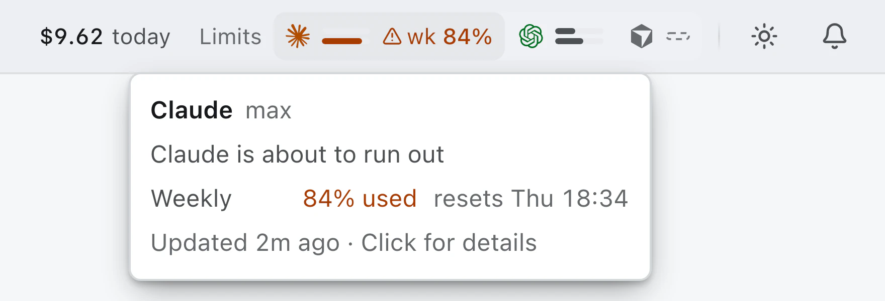
</picture>

### Usage limits chip

See how much of your Claude and Codex plans is left before a run stops. A top-bar chip shows the 5-hour window and the week, warns at 80%, and at 100% says when it comes back. Checking Claude spends no model tokens: Goodboy runs Claude's own `/usage` in an empty folder.

### Use reset

<picture>
  <source media="(prefers-color-scheme: dark)" srcset="./docs/readme/s16-codex-reset-dark.webp">
  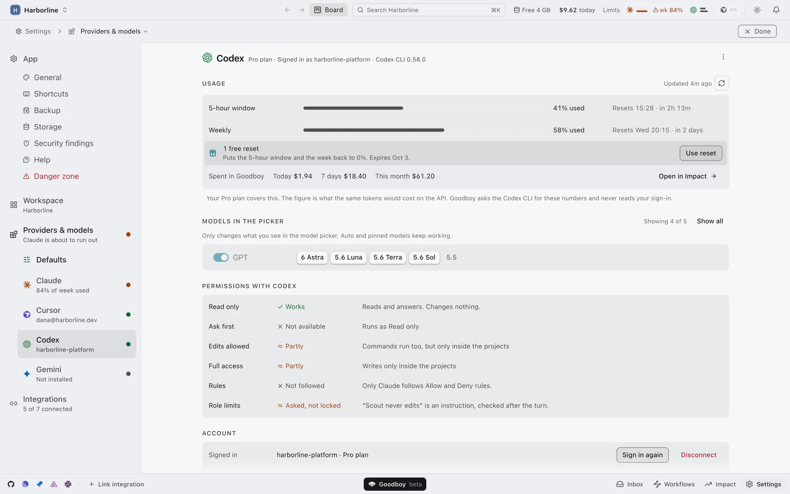
</picture>

Spend a free Codex reset at the right moment. When Codex offers one, the usage page shows it with its expiry and **Use reset**, and Goodboy warns you when spending it now would waste it.

### Fallback when a limit is hit

Keep a task moving when a provider runs out. With another eligible provider connected, the turn can move there, and the chat records where it went.

### Fallback order and Auto

Choose where **Auto** starts and the order it falls back through, with an Auto model for each role.

### Model picker

Pick a model with the reason next to it: **Auto**, a suggested model with its price ratio, the last one used, and family and effort chips. You choose which models appear.

### Impact

See what Goodboy got done and what it cost over 7 days, 30 days or all time, opening on one sentence built from your numbers.

### Monthly cap and budget alert

<picture>
  <source media="(prefers-color-scheme: dark)" srcset="./docs/readme/s24-impact-dark.webp">
  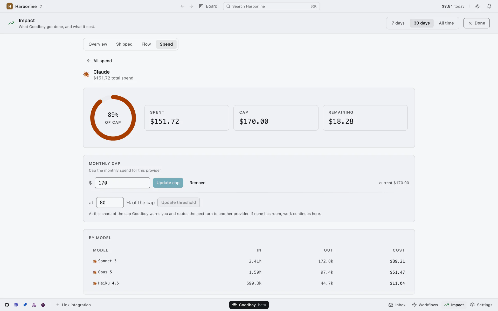
</picture>

Set a monthly cap per provider and hear about it before you reach it. Past the threshold Goodboy routes the next turn to another provider with room, and if none has room, work continues where it is.

## Storage

<picture>
  <source media="(prefers-color-scheme: dark)" srcset="./docs/readme/s25-storage-dark.webp">
  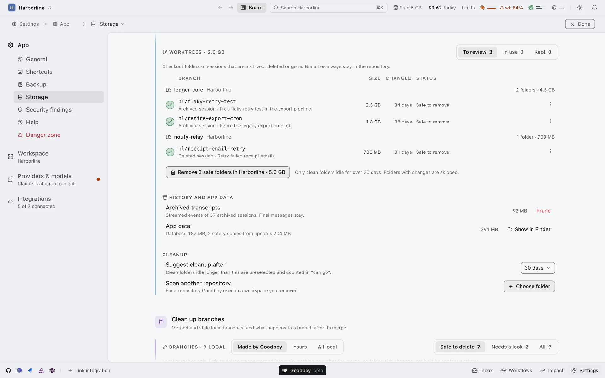
</picture>

### Worktree folders

Free disk space without guessing: worktree folders by repo, with their size, why each exists and whether it is safe to remove. Folders with changes, running agents or a git operation in progress are skipped, with the reason.

### Branches

Delete old branches with confidence. They are sorted into **Safe to delete** and **Needs a look**, each with its session and whether it still exists on origin, and squash-merged branches are spotted too.

### Storage scope

Clean up this workspace, other workspaces, removed ones or all of them, each with its weight, from the picker in the page header. Bulk actions name the scope they act on. The page reads as two groups: **Free up space** and **Clean up branches**.

### Free space chip

See reclaimable space at a glance. While at least 1 GB of worktree folders can go, the top bar shows **Free N GB**, and a click opens Storage at the folders.

### Artifacts from deleted sessions

Decide what to keep from sessions you deleted: their plans, reports and wireframes, with **Keep** or **Delete**.

### Goodboy can free N GB

Hear about reclaimable space once, when idle safe folders pass 10 GB or the disk runs low. After a notice it waits 14 days and another 10 GB before speaking again.

## Security, backup and updates

<picture>
  <source media="(prefers-color-scheme: dark)" srcset="./docs/readme/s26-security-dark.webp">
  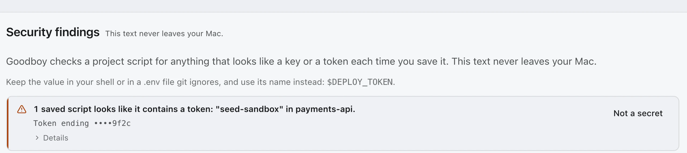
</picture>

### Security findings

Catch a token pasted into a saved script before it travels. Saving a script checks it for keys and tokens, and findings show in **Settings**, **App**, **Security findings**, where **Not a secret** dismisses one and **Flag again** brings it back.

### Findings kept out of the export

Move your setup to a new machine without carrying a flagged token: an export leaves out the script that holds it, unless you include it on purpose.

### Export and import your setup

Move workspaces, projects, workflows, scripts, rules and preferences to another machine, in groups. Import shows what it adds before writing, keys and sign-ins stay out of the export, and imported integrations ask you to sign in again.

### Backup before a data update

Update without worrying about your data. Before an update changes it, Goodboy makes a full copy and keeps the last two, and if the copy fails, the update does not start.

### Newer data guard

Open an older Goodboy on newer data without damage: it stops and offers **Restore backup** or **Quit**.

### Updates

Get updates in the background, then see what is new. With agents running, **Restart when they finish** waits for them.

### Changelog in the app

Read release notes inside the app, searchable, with links into the screen each change touched. After an update, "What's new since" covers the releases you skipped.

### Before and after pictures

See a change instead of reading about it. Release notes can show **Before** and **After** pictures, with a lightbox, in light and dark.

### Report a bug

Tell us what broke in one line. **⌘I** (**Ctrl+Shift+I** on Windows and Linux) opens a report sheet from any screen, and so do the footer chip, the palette, Settings, the macOS Help menu and **Report this** on a notification. Version, system, screen and CLI versions come along as chips you can remove, **What gets sent** shows exactly what leaves, and secrets, paths and emails are stripped. It files through gh, or opens the issue on GitHub. After a crash, the next launch offers to report it.

### Guide

Learn how Goodboy works in 18 short chapters that follow a task, with search and links that open each screen. Open **Guide** from the palette.

<h2>Keyboard and terminal</h2>

### Command palette

Find workspaces, sessions, agents, pages, scripts and actions with **⌘K**, using the same prefixes as the composer.

### Terminal

Open a real login shell in the session's worktree with **⌘T**, and find it still there after a reload.

### Keyboard shortcuts, back and forward

Drive Goodboy from the keyboard: about 40 shortcuts, a key for each view, workspaces 1 to 9, and **⌘[** and **⌘]** through history. One registry drives the keys, the help screen and the tooltips. **Esc** closes what is open inside the app and never takes the window out of macOS full screen.

### Notifications

Catch up in one place: a bell with an unread count, and a page filtered by severity and source.

### Script drawer

Watch a script's live output with **Stop**, **Run again** and the exit code, and pick it back up after a reload.

### Open in editor

Jump into VS Code, Cursor, Zed, the JetBrains IDEs, Sublime Text, Vim or Neovim, at the worktree or the file. VS Code and Cursor open it in the window you already have.

### Explore

Browse the session folder as a file tree with previews, and **Ask an agent about this file**.

## Also there

| Feature            | What it does for you                                                                     |
| ------------------ | ---------------------------------------------------------------------------------------- |
| Written by Goodboy | Comments Goodboy posts end with a line that says so, and a setting turns it off          |
| Resolve again      | Rereads a comment and tries the fix once more                                            |
| Checks             | The pull request's checks with durations, and a failed one becomes a **Next** suggestion |
| Settings rail      | Each settings area says what needs you, like folders not found                           |
| Update pill        | A single light sweep when an update is ready                                             |
