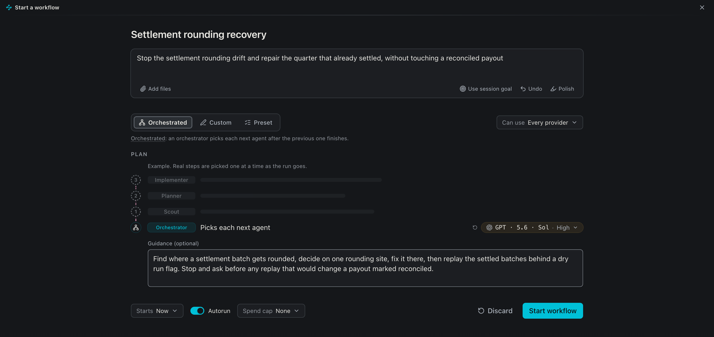
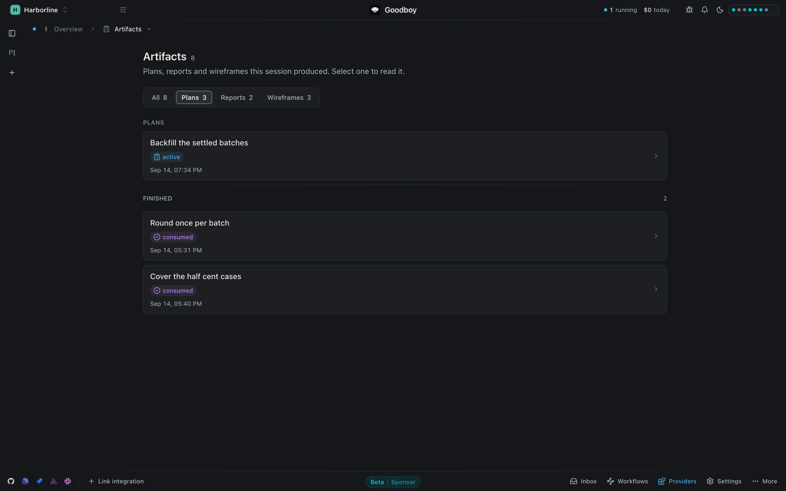
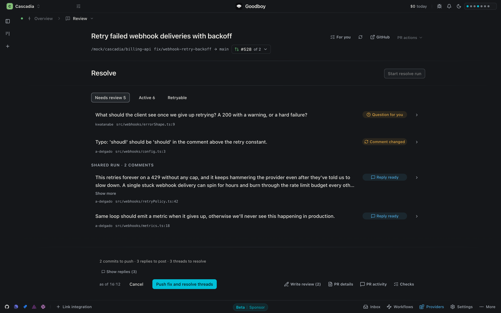
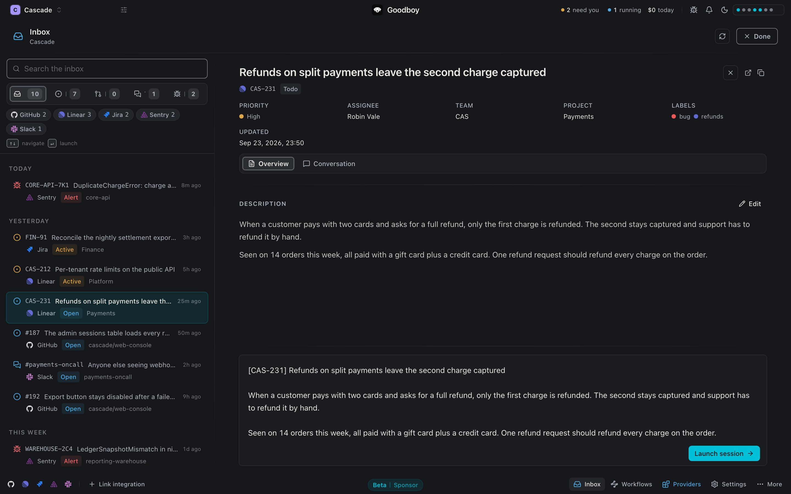
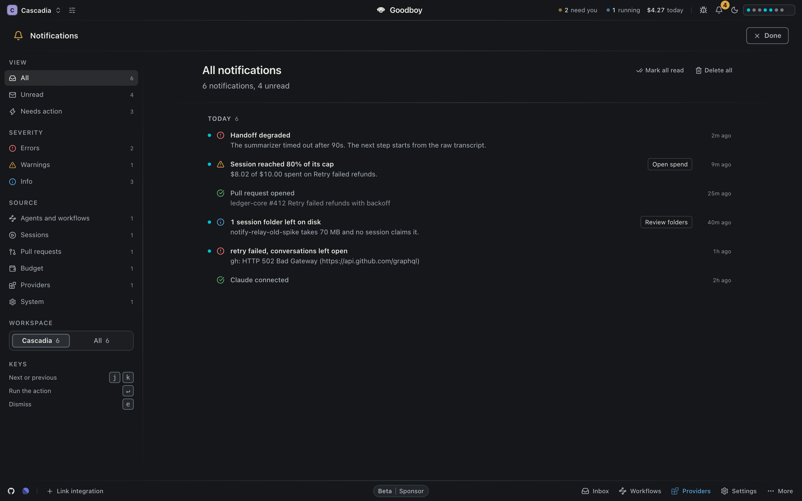
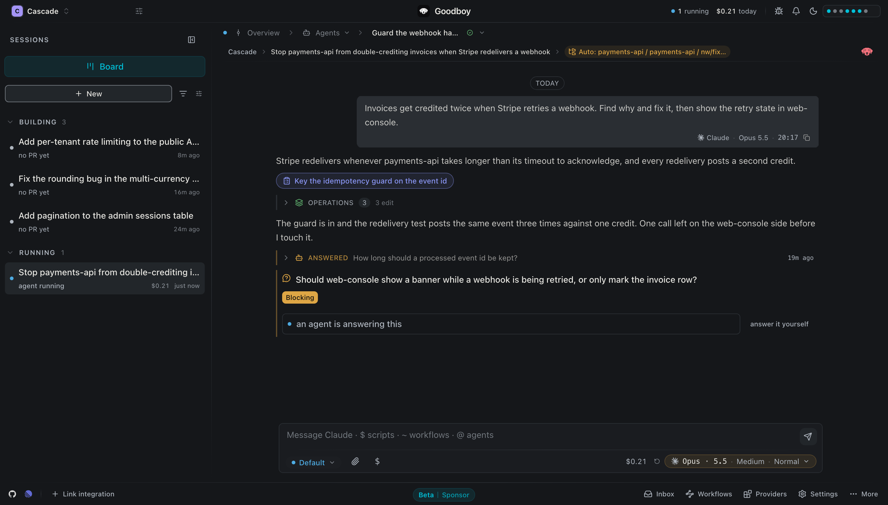

<div align="center">


[](https://github.com/akhayam99/goodboy/actions/workflows/ci.yml)
[](https://github.com/akhayam99/goodboy/releases/latest)
[](https://github.com/akhayam99/goodboy/stargazers)
[](./LICENSE.md)

[](#install)
[](#providers-and-quota)
[](./docs/concepts.md)
[](./docs/README.md)
[](https://goodboy-ai.dev)


</div>

<br>

Goodboy is a free, source-available desktop app for **macOS** and **Linux** that
runs coding agents on your work.

You describe a task once. The goal, the decisions and the running summary
belong to the task, not to a provider's chat.

Stop Claude halfway, hand the rest to Codex and come back tomorrow. Nobody
needs briefing again, and it all runs on the plan you already pay for.

<br>

## The board

Every task you start is a **session**, and every session sits on one board.

- Columns follow where each task is: **building**, **running**, **needs you**, **in review**, **done**
- Each card shows the project, the pull request, the cost so far and the issues the task came from
- The **needs you** column is where a task waits for your answer


<br>

## Session overview

Open a session and the **Overview** holds everything about that task.

- The goal, the decisions taken and a running summary
- The issues it is linked to, from GitHub, Linear, Sentry and the other tools
- Every repository it works on, with its branch and pull request

Below it, **Activity** draws the work as one tree: numbered steps growing from the bottom, with the agents they started, the plans, the questions and the pull requests on one timeline.

- Every step shows its provider, model and effort in the same columns, with its time and cost once it has them
- Once Goodboy has timed enough similar steps, a running step fills a ring with the time it has left
- A step waiting on you, a failed one and a queued one look different at a glance, and the next thing to do sits on top
- Click the colored line to open a workflow, click a row to open that agent, question or artifact

Come back after a day and you know where things stand.


<br>

## Workflows

A **workflow** splits a task into steps, for example explore, plan, implement, test.

- Each step runs as a new agent with a short brief
- Each step has its own provider, model and effort: explore on a cheap model, plan on a strong one
- Pick a ready workflow, build your own, or let the **orchestrator** choose the next step as the work goes

The builder shows the plan as the tree it will become, with an estimate of how long it takes once your workspace has enough timed steps. **Orchestrated** comes first and adds agents one at a time. In a custom or preset plan you change each step's provider, model, effort, role and instructions in place. Autorun is one switch, and runs show a readable name instead of the raw goal.



A running workflow reads like Activity, with a box on top to tell the orchestrator something before its next decision.


<br>

## Branches and worktrees

Agents work in their own copy of the code, not in yours.

- Every repository a session uses gets its own git worktree and branch
- Several sessions run at the same time without conflicts
- One session can work on more repositories, and on more branches of the same one, each with its own pull request
- From each row you open a terminal, run a project script or open the code in your editor


<br>

## Plans, reports and wireframes

When an agent writes a **plan**, a **report** or a **wireframe**, Goodboy saves it as an artifact with its own page.

- The next agent reads it instead of scrolling a chat
- A plan waits for you to run it, and says so, then stays in the list with the agent that ran it
- Filter by plans, reports or wireframes, and reopen or print any of them whenever you want



<br>

## Questions from the agents

When an agent needs a decision, it asks you, and the session moves to **needs you**.

- Every question comes with suggested answers you can pick or rewrite
- Choose **let an agent answer** to hand it to another agent, with a hint if you want
- The agent's answer counts as yours


<br>

## Pull request review

The **Review** tab shows a pull request with its checks and every comment thread.

- Send a comment to an agent: it fixes the code in a local commit and drafts the reply
- Each thread is marked: a question for you, a reply ready, a comment that changed
- Nothing is pushed or posted until you approve it



<br>

## Providers and quota

<div align="center">
  
</div>

Each provider signs in the way its own tool does.

- **Claude**, **Cursor** and **Codex**: the CLI login you already have
- **Gemini**: the Antigravity app
- **OpenCode**: its own login
- **OpenRouter** and **Moonshot**: an API key

In **Settings** you pick the default provider, the pool Goodboy can switch between and the model for each kind of task. Each provider can have a monthly cap: when one runs out, hits a rate limit or goes down, the next turn moves to another provider in the pool, and the chat tells you which one and why.

When a model needs a newer CLI than the one you have, Goodboy shows both versions and an update button, in Providers and in the chat.

[The provider guide](./docs/providers.md) covers installation and what each provider does differently.


<br>

## Costs

The **Impact** studio tracks what the agents spend.

- Split by provider, by model and by session
- Next to the monthly cap and the alert threshold
- So you see which models are worth what they cost


<br>

## Inbox

<div align="center">
  
</div>

Connect your tools and the **Inbox** lists their issues, pull requests, threads and errors in one place.

- Filter by tool or by kind
- Open an item and read it without leaving Goodboy
- Start a session from an item and Goodboy drafts a short title and goal, with a link back to it
- Keep the brief, edit it, or go back to the issue text before you press **Launch session**

Agents read from the same tools while they work, through the [query bridge](./docs/query-bridge.md).



<br>

## Notifications

The bell collects what Goodboy needs you to know: a step that failed, a session close to its cap, a pull request opened.

- One compact row each, with its action next to it
- Filters for unread, needs action, severity and source, each with its count
- **This workspace** by default, every workspace one click away
- **j** and **k** move through the list, **e** dismisses



<br>

## Chat

Every agent in a session has its own chat, for when you want to steer it yourself.

- Plans show up as cards that open the full artifact
- File edits are grouped under one row
- Open questions appear inline, including the ones another agent is answering for you



<br>

## Also in the box

- **Terminal**, **Explore** and **Diff** tabs on every session, one shortcut each
- A **command palette** for sessions, tabs and pages
- Open the worktree in **VS Code** or **Cursor** when you want to type yourself
- Pair a **phone** to follow a session away from the desk

<br>

## Install

On **macOS**, with Homebrew:

```bash
brew install --cask akhayam99/tap/goodboy
```

Or pick a package from the [latest release](https://github.com/akhayam99/goodboy/releases/latest):

- **macOS**: the `.dmg`, then drop Goodboy in Applications
- **Linux**: `AppImage`, `.deb` or `.rpm`

<br>

## Where your work lives

Everything Goodboy knows about your work stays on your machine.

- Task context, settings and usage records live in SQLite, in `~/.goodboy`
- The routing that picks the next provider runs locally too
- Prompts go to the provider you chose, and nothing else follows them

If Goodboy disappeared tomorrow your data would be untouched, because it was
never ours. [SECURITY.md](./SECURITY.md) has the detail.

<br>

## Run from source

You need **Node 22** or newer, **pnpm 10.33.4** and a **Rust** toolchain.

```bash
pnpm install
pnpm tauri:dev
```

- `pnpm tauri:build` produces a production build
- The [Tauri prerequisites](https://v2.tauri.app/start/prerequisites/) list the platform packages
- The [desktop notes](./apps/desktop/README.md) cover the local loop

<br>

## Documentation

Start at the [documentation index](./docs/README.md). From there:

- [Concepts](./docs/concepts.md): sessions, workspaces, projects and how they fit
- [Workflows](./docs/workflows.md): steps, the orchestrator and hands-free runs
- [Providers](./docs/providers.md): installation and sign-in for each one
- [Query bridge](./docs/query-bridge.md): how agents read from your tools
- [Architecture](./docs/architecture.md): how the app is built

<br>

## Contributors

[](https://github.com/akhayam99)
&nbsp;
[](https://github.com/teckperry)
&nbsp;
[](https://github.com/LucaPav01)

<br>

## Support Goodboy

The best support is using it.

- Run it on your real work
- Open an [issue](https://github.com/akhayam99/goodboy/issues) when something feels off
- Send a pull request
- Leave a star if it earns one

[](https://github.com/akhayam99/goodboy/stargazers)

<br>

## License

Source-available under [FSL-1.1-MIT](./LICENSE.md) © Amin Khayam. Use it for
your own projects or at work, just don't offer it, or something built on it,
as a competing product or service.
