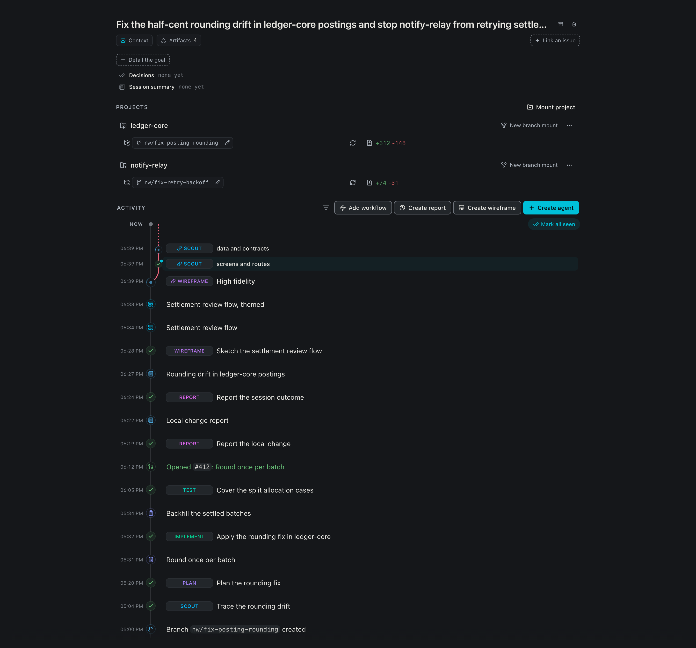

# Goodboy

**Stop re-explaining yourself.**

Goodboy is a free, open-source desktop app for macOS and Linux that runs coding
agents on your work. You describe a task once. The goal, the decisions and the
running summary stay on your disk, outside any provider's chat, so you can stop
Claude halfway, hand the task to Codex and come back tomorrow without briefing
anyone again. It runs on the Claude, Codex or Cursor plan you already pay for.
No account, no server.

[Get a release](https://github.com/akhayam99/goodboy/releases/latest) · [goodboy-ai.dev](https://goodboy-ai.dev) · [Read the documentation](./docs/README.md) · [CI](https://github.com/akhayam99/goodboy/actions/workflows/ci.yml)

## Open the app and see what needs you

Four terminals open and no idea which one is waiting on an answer. Goodboy's
home is a board with five columns, building, running, needs you, in review and
done, plus an archive at the end. Each card is a session, Goodboy's word for a
task; open it for the plan, the questions and the diff.


## Pick up a task cold

A chat makes you scroll back to find out what was decided. A session's Overview
keeps the goal, the mounted projects and an Activity feed: every agent run,
plan, report, branch and pull request in the order it happened, with a filter to
hide what you do not need right now.



## Scout on a cheap model, plan on a big one

One chat carries every earlier turn into the next, so the last small change
costs the most. A workflow is a sequence of steps, each with its own provider,
model and effort, and each step gets a fresh agent with a short brief. Steps run
one after another; pick a workflow, or describe the goal and let the
orchestrator build one.


## Seven providers, one routing pool

Burning the big model on a one-liner is easy when nothing is watching. Goodboy
connects seven providers, meters every turn locally and takes a monthly cap per
provider. When one is past its threshold, over its cap, at its usage limit or
unreachable, the next turn runs on another provider from your routing pool, and
the chat says which one and why.


## Agents work in a worktree, not in your checkout

Two agents editing the same checkout is a merge conflict waiting for you. Each
project a session touches gets its own git worktree and branch, with the reason
recorded, so several sessions run at once without touching each other's files. A
session can mount more than one project, and each mounted project carries its
own branch and pull request.


## Fix the review comment, keep the push

A pull request with nine comments is an afternoon of context switching. Review
shows the pull request, its checks and every comment thread. Resolve hands a
comment to an agent, which comes back with a local commit and a drafted reply,
and nothing reaches the pull request until you resolve it yourself.


## The plan is a page, not a message

A chat buries the plan under the next hundred lines. Here a plan, a report or a
wireframe is an artifact with its own page: written by one agent, consumed by
the next, superseded when a newer one lands, and yours to reread or print at any
time.


## Answer it yourself, or let an agent answer

An open question moves the session to needs you, and it waits there until
somebody decides. Each question comes with suggested answers to pick or
overwrite. If it is not worth your minute, hand it to another agent with a hint
or two: the answer counts as yours.


## Also in the box

- Terminal, Explore and Diff lenses on every session, one shortcut each
- A command palette for sessions, lenses and studios
- Open the worktree in VS Code or Cursor when you want to type yourself
- Pair a phone to follow a session away from the desk
- An Inbox for what GitHub, Linear, Jira, Sentry and Slack send you
- Impact: what the workspace spent, by provider, model and session

## Install

On macOS, install the signed and notarized universal build with Homebrew:

```bash
brew install --cask akhayam99/tap/goodboy
```

You can instead download the `.dmg` from the
[latest release](https://github.com/akhayam99/goodboy/releases/latest) and move
Goodboy to Applications. Homebrew upgrades the cask with:

```bash
brew upgrade --cask goodboy
```

Linux releases are x86_64 AppImage, `.deb` and `.rpm` packages:

```bash
sudo apt install ./Goodboy_<version>_amd64.deb
sudo rpm -i Goodboy-<version>-1.x86_64.rpm
chmod +x Goodboy_<version>_amd64.AppImage
```

Linux needs `libc6 >= 2.39`. Credentials use the freedesktop Secret Service, so
GNOME Keyring, KWallet or another compatible daemon must be running before you
save a personal API key. Windows has no installer and currently requires a
source build.

## Providers and integrations

Goodboy connects to Claude, Cursor, Codex, Gemini through Antigravity,
OpenCode, OpenRouter and Moonshot. Claude, Cursor and Codex log in with the CLI
you already use. OpenCode ships models that need no key. OpenRouter and
Moonshot take an API key, and one `opencode` binary serves all three. Installation,
authentication and provider-specific behavior are in
[the provider guide](./docs/providers.md).

GitHub, GitLab, Bitbucket, Jira, Linear, Sentry and Slack can connect to the
workspace. Each integration covers part of its service, not its whole API.
Keys are stored in the operating system credential store. Agents reach these
services through the documented [query bridge](./docs/query-bridge.md).

## Current limits

- Workflow steps run sequentially. Scout fan-out does not make workflow steps
  run in parallel.
- Linear can write descriptions and comments, but it cannot assign issues or
  change their status. Sentry is read-only. Slack has contract tests, but has
  not been exercised against a live workspace.

## Local data and network use

No account, no server. The task context, settings and local usage records live
in SQLite on your machine. Provider routing and usage metering also run there.
The app carries no telemetry.

Provider calls and connected services still leave the machine. Prompts and
responses go to the provider you choose, and requests to GitHub, Linear or
another connected service go to that service. A release build checks GitHub
for updates. If the app stops rendering, it can open an opt-in crash-report
prefill link in your browser. Nothing is filed unless you submit the issue.

[SECURITY.md](./SECURITY.md) documents credentials, diagnostics, update checks,
crash-report contents and the distinction between the desktop app and website.

If Goodboy disappeared tomorrow, your data would be untouched, because it was
never ours.

## Run from source

You need Node 20 or newer, pnpm 10.33.4 and a working Rust toolchain. Install
the workspace and start the Tauri development app:

```bash
pnpm install
pnpm tauri:dev
```

A production build uses `pnpm tauri:build`. CI currently builds with Node 22.
Read the [Tauri prerequisites](https://v2.tauri.app/start/prerequisites/) for
platform packages and [desktop development notes](./apps/desktop/README.md) for
the local loop.

The app uses Tauri 2, React 19, TypeScript, Zustand and SQLite in a pnpm and
Turborepo monorepo.

## Documentation and contributing

Start with the [documentation index](./docs/README.md). The deeper references
cover [concepts](./docs/concepts.md), [workflows](./docs/workflows.md),
[providers](./docs/providers.md), the [query bridge](./docs/query-bridge.md) and
[architecture](./docs/architecture.md).

If something breaks, feels off or is missing, [open an issue](https://github.com/akhayam99/goodboy/issues/new).
Half-formed thoughts welcome, and "this feels wrong" is a valid bug report.
Before changing code, read [AGENTS.md](./AGENTS.md) and
[CONVENTIONS.md](./CONVENTIONS.md).

## Contributors

[Amin Khayam](https://github.com/akhayam99) · [Luca Laudiero](https://github.com/teckperry)

## License

[MIT](./LICENSE) © Amin Khayam
