<div align="center">

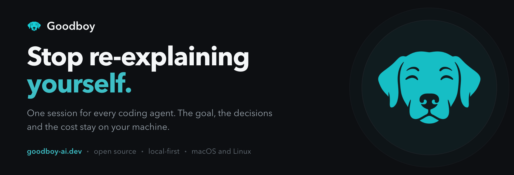

[](https://github.com/akhayam99/goodboy/actions/workflows/ci.yml)
[](https://github.com/akhayam99/goodboy/releases/latest)
[](https://github.com/akhayam99/goodboy/stargazers)
[](./LICENSE.md)

[Install](#install) &nbsp;·&nbsp; [Providers](#providers-and-integrations) &nbsp;·&nbsp; [Concepts](./docs/concepts.md) &nbsp;·&nbsp; [Documentation](./docs/README.md) &nbsp;·&nbsp; [goodboy-ai.dev](https://goodboy-ai.dev)

<sub>Tauri 2 &nbsp;·&nbsp; React 19 &nbsp;·&nbsp; TypeScript &nbsp;·&nbsp; SQLite</sub>

</div>

<br>

Goodboy is a free, source-available desktop app for macOS and Linux that runs
coding agents on your work.

You describe a task once. The goal, the decisions and the running summary
belong to the task, not to a provider's chat.

Stop Claude halfway, hand the rest to Codex and come back tomorrow. Nobody
needs briefing again, and it all runs on the plan you already pay for.

<br>

## A board, not a chat window

Four terminals open and no idea which one is waiting on you.

Goodboy's home is a board of sessions. A session is one task, with its plan,
its questions and its diff. Nobody has to ask you where things stand.

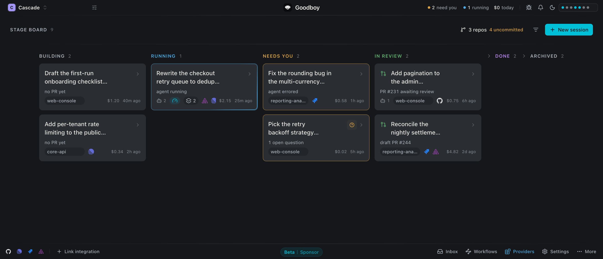

<br>

## Pick up a task cold

A chat makes you scroll back to find out what was decided.

The Overview holds the goal, the decisions and the repositories the session
touches. Under it, Activity replays what happened: every step, the agents a
step fanned out into, the plans, the branches, the pull requests. Start a
second workflow before the first one ends and the feed keeps the two apart.


<br>

## Scout on a cheap model, plan on a big one

One chat carries every earlier turn into the next, so the last small change
costs the most.

A workflow is a sequence of steps, and each step gets its own provider, model
and effort, plus a fresh agent with a short brief. Pick a workflow, or
describe the goal and let the orchestrator build one for you.

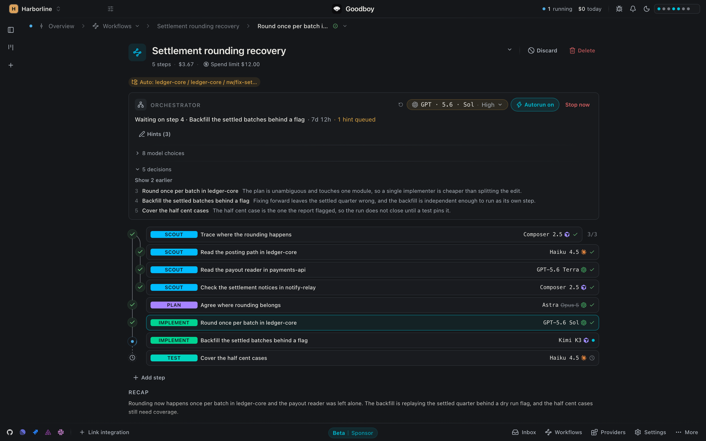

<br>

## Run out of quota and the task keeps going

Burning the big model on a one-liner is easy when nothing is watching.

Goodboy meters every turn and holds a monthly cap per provider. When one is
spent, limited or unreachable, the next turn runs on another provider from
your pool, and the chat tells you which one and why.

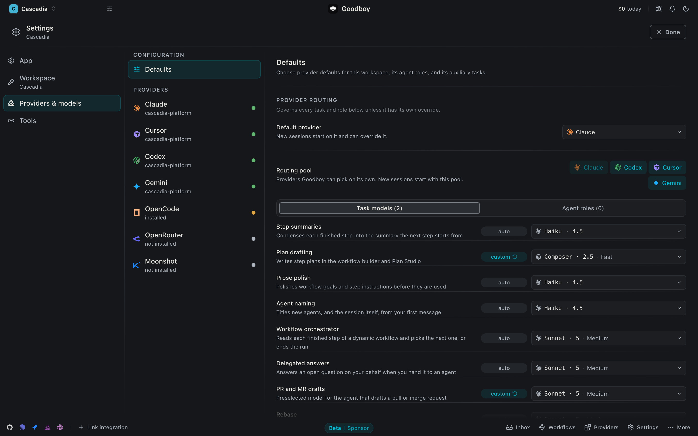

<br>

## See what the work cost

Agents spend money while you are looking somewhere else.

Impact keeps the running total, split by provider, by model and by session,
next to the cap and the threshold that moves the next turn elsewhere. You can
tell which model earned its price.

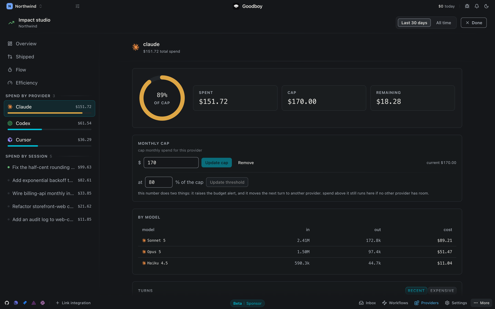

<br>

## Nobody edits your checkout

Two agents in the same working copy is a merge conflict waiting for you.

Every repository a session touches gets its own worktree and branch, so
several sessions run at once without stepping on each other. One session can
hold more than one repository, each with its own branch and pull request.

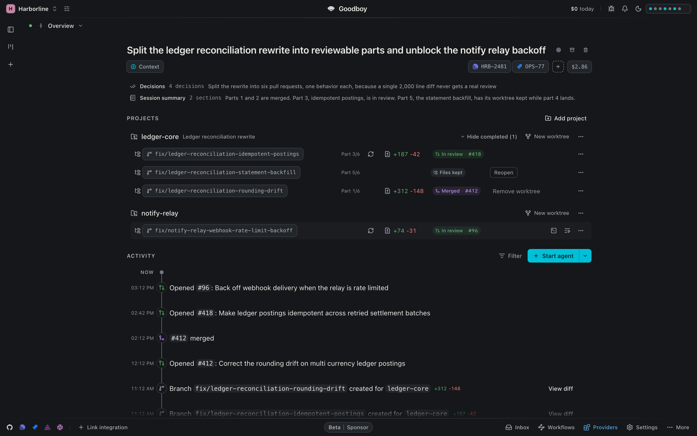

<br>

## A review comment comes back as a commit

A pull request with nine comments is an afternoon of context switching.

Review shows the pull request, its checks and every thread. Hand a comment to
an agent and it returns a local commit and a drafted reply. Nothing reaches
the pull request until you say so.

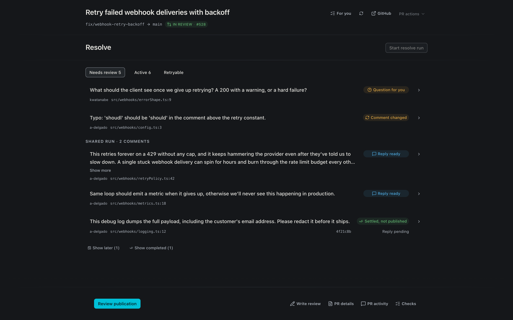

<br>

## The plan does not scroll away

A chat buries the plan under the next hundred lines.

A plan, a report or a wireframe is an artifact with its own page: written by
one agent, read by the next, superseded when a newer one lands, and yours to
reread or print whenever.

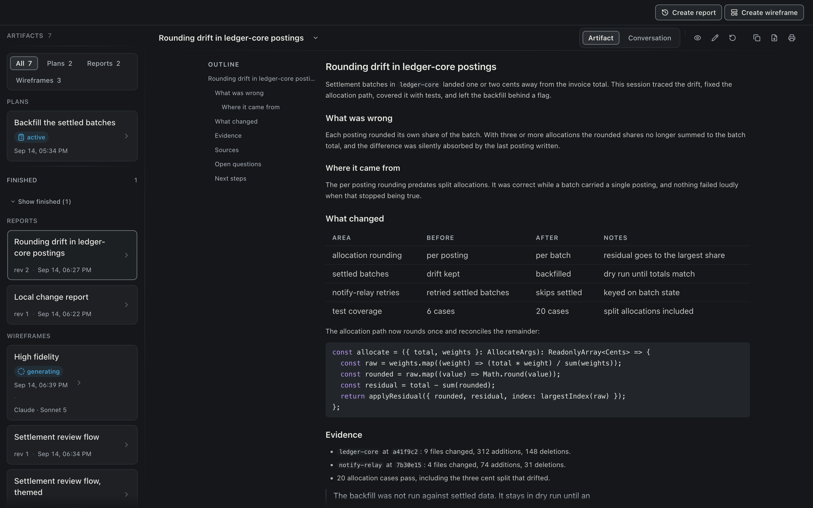

<br>

## Answer it yourself, or let an agent answer

An open question moves the session to needs you, and it waits there until
somebody decides.

Every question arrives with suggested answers to pick or overwrite. If it is
not worth your minute, hand it to another agent with a hint. The answer counts
as yours.

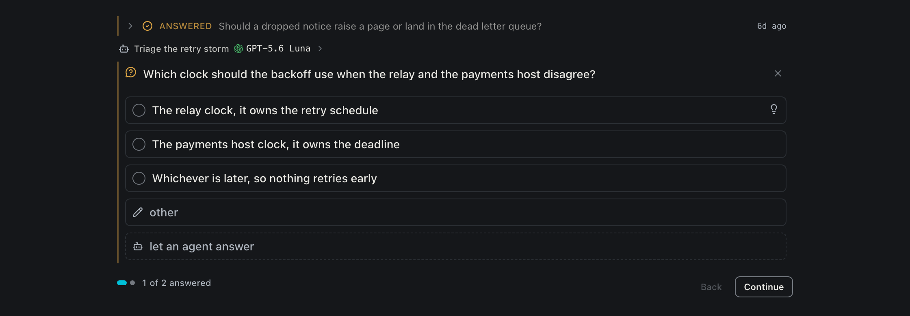

<br>

## Also in the box

- Terminal, Explore and Diff lenses on every session, one shortcut each
- A command palette for sessions, lenses and studios
- Open the worktree in VS Code or Cursor when you want to type yourself
- Pair a phone to follow a session away from the desk
- One Inbox for what your trackers and review tools send you

<br>

## Install

On macOS:

```bash
brew install --cask akhayam99/tap/goodboy
```

Or take the `.dmg` from the
[latest release](https://github.com/akhayam99/goodboy/releases/latest) and drop
Goodboy in Applications. Linux releases ship as AppImage, `.deb` and `.rpm` on
the same page.

<br>

## Providers and integrations

<div align="center">
  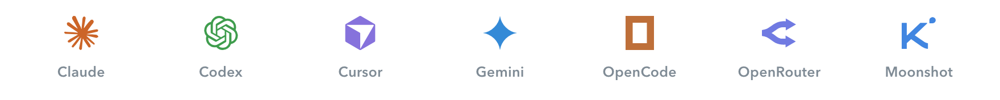
</div>

Claude, Cursor and Codex sign in with the CLI you already use, and the rest
take a key. Connect a second one and it inherits the session it joins.
[The provider guide](./docs/providers.md) covers installation and what each
provider does differently.

<div align="center">
  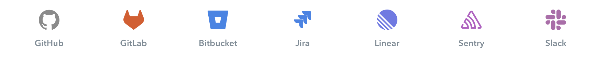
</div>

Connect the tools you already work in and agents read from them through the
[query bridge](./docs/query-bridge.md).

<br>

## Where your work lives

The task context, the settings and the usage records sit in SQLite on your
machine, and so does the routing that picks the next provider. Prompts go to
the provider you chose, and nothing else follows them.

[SECURITY.md](./SECURITY.md) has the detail. If Goodboy disappeared tomorrow
your data would be untouched, because it was never ours.

<br>

## Run from source

You need Node 20 or newer, pnpm 10.33.4 and a Rust toolchain.

```bash
pnpm install
pnpm tauri:dev
```

`pnpm tauri:build` produces a production build. The
[Tauri prerequisites](https://v2.tauri.app/start/prerequisites/) list the
platform packages, and the [desktop notes](./apps/desktop/README.md) cover the
local loop.

<br>

## Documentation

Start at the [documentation index](./docs/README.md), which leads to
[concepts](./docs/concepts.md), [workflows](./docs/workflows.md),
[providers](./docs/providers.md), the [query bridge](./docs/query-bridge.md)
and [architecture](./docs/architecture.md).

<br>

## Contributors

[](https://github.com/akhayam99)
&nbsp;
[](https://github.com/teckperry)

[Amin Khayam](https://github.com/akhayam99) &nbsp;·&nbsp; [Luca Laudiero](https://github.com/teckperry)

Your face fits here too. Pick an
[issue](https://github.com/akhayam99/goodboy/issues), open a pull request, and
read [AGENTS.md](./AGENTS.md) and [CONVENTIONS.md](./CONVENTIONS.md) before you
start.

<br>

## Support Goodboy

The best support is using it. Run it on real work,
[open an issue](https://github.com/akhayam99/goodboy/issues/new) when something
feels off, send a pull request, and leave a star if it earns one.

<br>

## License

Source-available under [FSL-1.1-MIT](./LICENSE.md) © Amin Khayam. Free to use,
at work too, not to be sold as a competing product.
