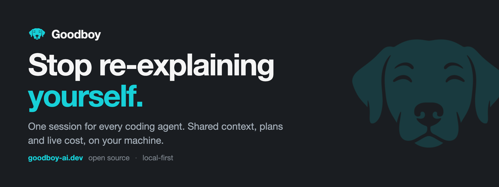

<div align="center">



[](https://github.com/akhayam99/goodboy/actions/workflows/ci.yml)
[](https://github.com/akhayam99/goodboy/releases/latest)
[](https://github.com/akhayam99/goodboy/stargazers)
[](#providers)
[](#install)
[](#install)
[](./LICENSE)


[Install](#install) · [Providers](#providers) · [Concepts](./docs/concepts.md) · [Design](./DESIGN.md) · [goodboy-ai.dev](https://goodboy-ai.dev)

</div>

> **Read this when** you're new here, human or agent, and want the pitch, install steps, and feature tour. **Not for** working conventions once you're building. Go to `AGENTS.md`.


You have a repo. You have a goal. You also have several CLIs open in
several windows, each holding a slightly different version of the same
task. By evening you've spent more time pasting the goal back into the
next chat than actually building.

Goodboy is a desktop app that holds the goal, the plan and the context once,
then hands them to whichever agent you want to run next. Same brief, different
model: each agent keeps its own transcript and inherits the shared context, so
nothing gets pasted twice and nothing gets crossed. Conversation, plans, decisions and PR state live in
a local SQLite on your machine, scoped to Goodboy alone: a local reset clears
that database without touching anything outside it. Your keys, your data,
your bandwidth.

Open source. Every feature included. No paywall, no telemetry, no account.

## What's inside

**Shared context, not vendor sessions.** Goal, decisions, last summary, open
questions, kept fresh by a summarizer after every turn and editable by hand.
The next agent shows up already briefed.

**Provider swap mid-task, without amnesia.** Each turn is rebuilt from the
shared context, never resumed from a vendor's session blob. Drop Claude
halfway, hand the same task to Cursor, Codex, Antigravity, OpenCode, OpenRouter or
Moonshot, watch it pick up clean.

**Workflows for the multi-step stuff.** A cheap model to scout the area, a
smart one to plan it, a mid one to implement, another to review. Each step
picks its own provider and model, so you're never paying Opus prices to run a
grep.

**Plans as artifacts, not transcript scrollback.** Agents write the plan
before they touch your code, and it stays put: read it, edit it, hand it to
whichever model implements it.

**GitHub, GitLab and Bitbucket studios.** Every pull request or merge request
you're involved in, in one inbox, bucketed by state. Open one for the body,
lifecycle controls and unresolved comments in a single view. Reply yourself,
or hand a comment to an agent to resolve. Bitbucket Cloud connects with a
workspace slug, your Atlassian email and an API token, merges with whatever
strategy the repository is set to, and cannot reopen a declined request.

**Issues that become sessions.** Linear, Jira Cloud and Sentry each get the
same inbox, and launching from an item pre-fills the goal and names the
branch. Jira covers one project key at a time: comment, assign, move through
real transitions, edit the description. Creating issues, sprints, boards and
Jira Server are not there yet.

**Slack, read the thread and reply.** Connect a workspace with a bot token
(`xoxb-`) held in your OS keychain. Public channels the bot has joined only,
no DMs, most recent 200 messages per channel. Launch a session from a thread
and the goal pre-fills from it; replies post as the bot, as plain text.
Follow-up: every call is contract-tested against fixtures, none has run
against a live workspace yet.

**Cost meter that taps your shoulder.** Every session shows what it's costing
as it runs, and nudges you before you burn Opus on a one-liner.

## The board

Home is a board, not a chat window. Every session in the workspace is in front
of you at once, grouped by where it stands: needs you, running, in review,
building, done. Each card carries the goal, the live cost, the PR state and
the agents on it, one click from the chat, the diff, the terminal or your
editor. Open one and an overview leads; chat, the diff, the studios and the
terminal are lenses you navigate to, not a wall of scrollback.

## Providers

Bring the subscription you already pay for. Goodboy drives the official CLIs
locally, on your existing plan. OpenRouter and Moonshot are the exceptions:
API-key providers that run through the OpenCode runtime, with the key held in
your OS keychain.

| Provider                 | CLI                                                            | Subscription                   |
| ------------------------ | -------------------------------------------------------------- | ------------------------------ |
| **Anthropic (Claude)**   | `npm i -g @anthropic-ai/claude-code`                           | Claude Max / Pro               |
| **Cursor**               | Cursor desktop app                                             | Cursor Pro                     |
| **OpenAI (Codex)**       | `npm i -g @openai/codex`                                       | ChatGPT Pro                    |
| **Google (Antigravity)** | `curl -fsSL https://antigravity.google/cli/install.sh \| bash` | Google AI Pro                  |
| **OpenCode** (beta)      | `npm i -g opencode-ai`                                         | None, zero-key models included |
| **OpenRouter** (beta)    | Runs through the OpenCode runtime, no separate install         | OpenRouter API key             |
| **Moonshot AI** (beta)   | Runs through the OpenCode runtime, no separate install         | Moonshot API key               |

One connected CLI is enough to start. Full guide:
[docs/providers.md](./docs/providers.md).

## Install

**macOS.** Intel and Apple Silicon in one universal build, signed and notarized,
so it opens without the unidentified-developer warning.

```bash
brew install --cask akhayam99/tap/goodboy
```

Or drag the `.dmg` from the
[latest release](https://github.com/akhayam99/goodboy/releases/latest) to
Applications.

**Linux.** x86_64 on glibc 2.39 or newer, so Ubuntu 24.04 and Debian 13 upward,
as an AppImage, a `.deb` or an `.rpm` on the same
[release](https://github.com/akhayam99/goodboy/releases/latest).

```bash
sudo apt install ./Goodboy_<version>_amd64.deb
sudo rpm -i Goodboy-<version>-1.x86_64.rpm
chmod +x Goodboy_<version>_amd64.AppImage
```

The `.deb` declares what it links against (`libc6 (>= 2.39)`,
`libwebkit2gtk-4.1-0`, `libgtk-3-0`, `libsoup-3.0-0` and the rest of the GTK
stack) via `dpkg-shlibdeps`, so apt resolves them for you. The `libc6` entry
sets the floor above, and all three packages share it since they come out of
one `ubuntu-latest` build. Credentials go to the freedesktop Secret Service,
GNOME Keyring or KWallet, so a keyring daemon has to be running before you
save a token. Windows is still a build from source. Security posture and the
credential caveat: [SECURITY.md](./SECURITY.md).

**Updates.** Automatic on macOS: an update control appears in the footer and
workspace launcher when a new release ships, and one click downloads and
relaunches. Homebrew users can also `brew upgrade --cask goodboy`. On Linux,
take the new package from the release.

## Run it

```bash
pnpm install
pnpm tauri:dev
```

Needs **Node ≥ 20**, **pnpm ≥ 10** and a working **Rust** toolchain. Platform
prereqs: <https://v2.tauri.app/start/prerequisites/>. Dev-loop notes:
[apps/desktop/README.md](./apps/desktop/README.md).

Website maintenance: `pnpm --dir website build:og` regenerates
`website/public/og-image.png`. The hero headline and subtitle are duplicated
inside `website/scripts/build-og.mjs`; update that copy with the hero, then
regenerate the image.

**Tauri 2 · React 19 · TypeScript · Tailwind v4 · Zustand · SQLite**, in a
pnpm + Turborepo monorepo: `apps/desktop` plus `packages/{ui,core,db,types}`.

## Zero data ownership

Goodboy is a pure orchestration layer. We do not run servers. We do not have
accounts. We do not store, log, or transmit your data anywhere except to the
services you connected yourself.

- No backend. Ever.
- No telemetry. Not now, not later, not opt-in.
- API keys and tokens stay on your machine, in your OS credential store.
- Conversations, prompts, and responses flow directly between you and the
  provider.
- What you send to a connected integration reaches that integration: a
  comment posted to GitHub is a comment on GitHub, and its token travels with
  every request. Local storage does not mean nothing leaves.
- Local persistence is SQLite (`~/.goodboy/data.db`): workspaces, sessions,
  agents, messages, context slots, plans, local usage records, skills,
  settings. All yours, all local, and cleared only when you ask.

If Goodboy disappeared tomorrow, your data would be untouched, because it was
never ours.

## How it ships

Goodboy ships Goodboy. Releases are decided, built, verified and drafted by an
autonomous delivery loop of agents, with a human reviewing after rather than
before. Every PR is checked by a different agent than the one that wrote it,
and anything never exercised against a live tenant is named in the release
notes. The loop runs against a written floor it cannot edit on its own
authority: it never touches signing material or secrets, never force-pushes,
never publishes without a human, and stops rather than guess.

## Help out

Try it. If something breaks, feels weird or is missing, open an issue: the bug
control in the top right, Settings, "Report an issue" in the command palette,
or straight on GitHub. The in-app form sends five things: version, type, area,
title, notes. Nothing else, and no screenshots yet. Half-formed thoughts
welcome, "this feels off" is a valid bug report. Issues are triaged every
release cycle, so you get an answer even when it's "not yet". A request for
anything the project refuses on principle, tracking above all, gets a written
no rather than silence.

## Star history

<a href="https://www.star-history.com/?repos=akhayam99%2Fgoodboy&type=date&legend=top-left">
  
</a>

## More

- [docs/tone-of-voice.md](./docs/tone-of-voice.md): how Goodboy talks
- [docs/concepts.md](./docs/concepts.md): what every object in the app is
- [DESIGN.md](./DESIGN.md): how it looks and behaves
- [CONVENTIONS.md](./CONVENTIONS.md) · [CLAUDE.md](./CLAUDE.md): contributor rules
- Roadmap and the delivery organization live in `goodboy-atlas`, a private
  repository. The app never depends on it, and contributing never requires it.

## License

[MIT](./LICENSE) © Amin Khayam
