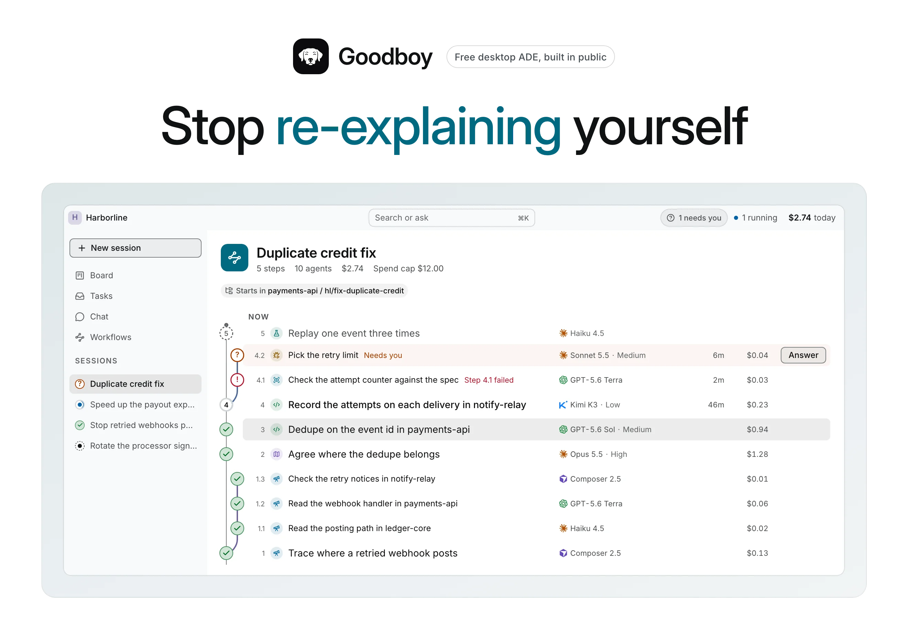

<div align="center">

<picture>
  <source media="(prefers-color-scheme: dark)" srcset="./docs/readme/readme-hero-dark.webp">
  
</picture>

[](https://github.com/akhayam99/goodboy/actions/workflows/ci.yml)
[](https://github.com/akhayam99/goodboy/releases/latest)
[](https://github.com/akhayam99/goodboy/stargazers)

[](#install)
[](./FEATURES.md)
[](./docs/providers.md)
[](./docs/concepts.md)
[](./docs/README.md)
[](https://goodboy-ai.dev)


</div>

<br>

Goodboy is a desktop app for coding agents, on **macOS** and **Linux**. Connect the providers you already use, Claude, Codex, Cursor and four more, point it at your repos, and hand it a task. Each task becomes a session that keeps its own goal, decisions and summary, so every agent that works on it starts briefed and nobody tells the story twice.

<br>

## For developers

Inside a session every chat has one job. A scout reads the code on a light model, a planner decides on a strong one, implementers write and a tester checks. Agents work in their own copy of each repo, so your checkout stays yours, and a task that spans payments-api and notify-relay gets a branch and a pull request in each.

Five tasks in flight? The activity bar keeps each one where you left it, and **⌘K** and **⌘F** take you anywhere. Review comments from GitHub, GitLab or Bitbucket come back as commits, several fixed side by side, with the reply drafted in your voice, and a messy branch gets tidied by dragging its commits around. When you only want an answer, **Chat** reads every project of the workspace without changing a file, and one press turns the answer into a session.

<br>

## For leads and project managers

The board shows where every task stands, **building**, **running**, **needs you** or **in review**, with its pull request and what it has cost so far. Work starts from Linear, Jira, GitHub, GitLab, Bitbucket, Sentry or Slack with the brief already drafted, and plans and decisions are written down next to the task instead of lost in a chat. Set a monthly cap per provider and Goodboy warns you before you cross it, not after.

<br>

## Install

On **macOS**, with Homebrew:

```bash
brew install --cask akhayam99/tap/goodboy
```

Or pick a package from the [latest release](https://github.com/akhayam99/goodboy/releases/latest):

- **macOS**: the `.dmg`, then drop Goodboy in Applications
- **Linux**: `AppImage`, `.deb` or `.rpm`

<br>

## Features

Every feature, with pictures, is in [FEATURES.md](./FEATURES.md). [goodboy-ai.dev](https://goodboy-ai.dev) tells the same story in a minute.

<br>

<a id="where-your-work-lives"></a>

## Privacy

- Tasks, decisions, settings and usage records stay on your computer, in `~/.goodboy`
- Prompts go to the provider you chose
- Tool keys go in your system credential store
- No account, and no Goodboy server

<br>

## Run from source

You need **Node 22** or newer, **pnpm 10.33.4** and a **Rust** toolchain.

```bash
pnpm install
pnpm tauri:dev
```

- `pnpm tauri:build` produces a production build
- The [Tauri prerequisites](https://v2.tauri.app/start/prerequisites/) list the platform packages
- The [desktop notes](./apps/desktop/README.md) cover the local loop

<br>

## Documentation

Start at the [documentation index](./docs/README.md). From there:

- [Concepts](./docs/concepts.md): sessions, workspaces, projects and how they fit
- [Workflows](./docs/workflows.md): steps, the orchestrator and hands-free runs
- [Providers](./docs/providers.md): installation and sign-in for each one
- [Query bridge](./docs/query-bridge.md): how agents read from your tools
- [Architecture](./docs/architecture.md): how the app is built

<br>

## Contributors

[](https://github.com/akhayam99)
&nbsp;
[](https://github.com/teckperry)
&nbsp;
[](https://github.com/LucaPav01)

<br>

## Support Goodboy

The best support is using it.

- Run it on your real work
- Press **⌘I** in the app when something feels off, or you have an idea
- Open an [issue](https://github.com/akhayam99/goodboy/issues)
- Send a pull request
- Leave a star if it earns one

[](https://github.com/akhayam99/goodboy/stargazers)
